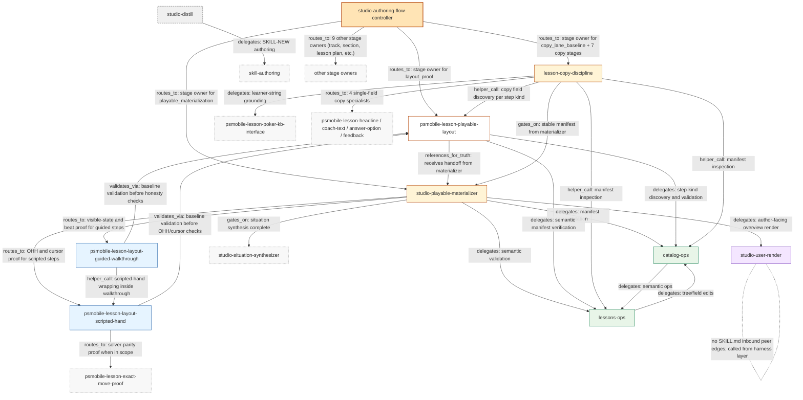

# TL;DR

**Outcome.** When `skill-flow` is pointed at a skill suite — by name, by flow, or "every skill in this project" — it spawns parallel sub-agents to walk those skills, aggregates the walk into one concrete **DAG substrate** with **labeled edges that explain each skill-to-skill relationship**, then reasons from that substrate to produce a findings-first audit of **wasted energy**: redundant skills, repeatedly-duplicated work across stages, over-invoked skills that look like hand-coded loops, dead skills nobody actually calls, broken edges to non-existent peers, and over-promoted helpers masquerading as canonical stages. A d2 render of the substrate is produced **only when the user asks for it**. The audit reports findings with evidence and the smallest credible fix; it does not perform or orchestrate any fix.

**Problem.** Today `skill-flow` reasons about a flow from whatever the agent happens to read in one pass. That works for a 3-skill suite. It does not work for `lessons_studio`'s 42 Doctrine-authored skills, where waste hides in plain sight — e.g., `psmobile-lesson-playable-layout` is promoted as a canonical post-materialize stage even though `studio-playable-materializer` already owns the same acceptance criteria, and `studio-authoring-flow-controller`'s stage contracts encode that overlap as if it were intentional. A reader cannot see that without holding 3+ SKILL.md files in their head simultaneously, and there is no concrete artifact for the agent (or a reviewer) to point at when discussing the suite.

**Approach.** Three moves, in order:

1. **Resolve scope from plain language.** "Every skill in this project", "only the skills for flow F1", "X, Y, Z" — the skill turns the user's natural-language scope into a concrete skill list before walking anything.
2. **Parallel-walk the scoped skills**, by default, using sub-agents. Each sub-agent reports per-skill evidence: declared job, declared peer references, declared invocations, declared adjacent surfaces, with `path:line` anchors.
3. **Aggregate into a DAG substrate** — one concrete artifact written in a chosen text format (substrate format itself is a Decision Gap; candidates include mermaid, structured markdown, d2, or another agent-friendly format that supports labeled edges). Every edge carries a short label explaining the relationship (e.g., "delegates manifest building to", "validates output of", "is helper called inside stage X"). The agent reasons from this substrate, not from re-walking the tree, when producing findings. d2 + SVG render is an optional secondary output.

The smart-agent reasoning stays in the prompt; the substrate is exact-truth grounding so the agent does not have to re-derive the frontier mid-audit. The audit emits findings — that's it. Acting on the findings (writing edits, retiring skills, demoting stages) is out of scope for this audit and stays a human or downstream-skill decision.

**Plan.**
1. Lock the substrate format, the labeled-edge vocabulary, the reference-extraction conventions, and the parallel-fanout shape from real repo evidence (`arch_skill` + `lessons_studio`).
2. Ship the scope-resolver and parallel-walk fanout, fail-loud on ambiguous scope or unreadable skills.
3. Ship the substrate writer (one chosen format) with labeled edges, deterministic for an unchanged tree.
4. Ship the d2 renderer (on-request) using the rally toolchain pattern, fail-loud when `d2` is not on PATH.
5. **At implementation time**, author the new audit sub-mode and supporting references using `$prompt-authoring` (WHY-first prompt contract) and `$skill-authoring` (package shape) — these are *build-time* tools for shipping the audit, not runtime dependencies of the audit itself. Carry a recognition-test catalog for waste patterns and the `lessons_studio` over-promotion case as a worked example in the example reference, not in the audit prompt itself.
6. Update `skill-flow`'s SKILL.md routing, the repo's AGENTS.md skill-routing block, and the usage guide so callers know when to reach for the new audit shape.

**Non-negotiables.**
- Smart agents over heuristic gates. The substrate provides exhaustive grounding; the audit verdict comes from prompt-driven judgment, not a redundancy-score rule.
- WHY-first prompt contract. Commander's intent at the top; mechanics demoted; recognition tests over keyword routers.
- The DAG is the agent's reasoning substrate, not a deliverable. The user gets the audit findings; the substrate is the scratchpad the agent wrote so it could reason concretely. d2/SVG render only when the user asks for it.
- Every edge in the substrate carries a short relationship label. Bare adjacency is not enough.
- Parallel-agent walk by default. Serial fallback exists only when the scope is so small that fanout costs more than it saves; the skill chooses based on scope size, not user flag.
- Plain-language scope resolution. The user says what they want in their own words; the skill resolves it. No required CLI flag taxonomy.
- One chosen substrate format. No parallel paths or alternate "lite" formats.
- This is an **audit-only** enhancement. The new path produces findings; it does not write fixes, route fixes to other skills as a runtime contract, or orchestrate any repair workflow. Acting on findings is out of scope.
- Capability-first. Native model reasoning + grounded file access does the audit; deterministic utilities exist only for substrate writing and d2 emission.
- Fail-loud boundaries. Missing `d2` binary (only when render was requested), missing target skills dir, unreadable skill, unresolvable scope phrase — each stops the run with a named error.
- No fallbacks or runtime shims (`fallback_policy: forbidden`). Hard cutover; explicit deletes; no parallel paths in the substrate writer or renderer.
- Existing `design`, `audit`, and `repair` modes continue to work unchanged. The new path is additive.
- The shipped skill stays self-contained. No hidden cross-repo deps; rally and doctrine are reference inspiration only.

<!-- arch_skill:block:planning_passes:start -->
<!--
arch_skill:planning_passes
deep_dive_pass_1: done 2026-04-25
recommended_flow: research -> deep dive -> phase plan -> implement
note: This block tracks stage order only. It never overrides readiness blockers caused by unresolved decisions.
-->
<!-- arch_skill:block:planning_passes:end -->

<!-- arch_skill:block:implementation_audit:start -->
# Implementation Audit (authoritative)
Date: 2026-04-25
Verdict (code): COMPLETE
Manual QA: pending (non-blocking)

## Code blockers (why code is not done)
- None. Phases 1-8 satisfy every `Checklist (must all be done)` item and every `Exit criteria (all required)` item against repo reality. The full §6.1 change-map (13 rows) is implemented. Existing `design`/`audit` (top-level)/`repair` procedures and SKILL.md sections (Non-negotiables, First move, Output expectations) are byte-identical to pre-change content (verified via `git diff 89dca11`). Determinism snapshot test on `scripts/render_dag_d2.py` produces byte-identical output (`diff` exit 0 against `tiny_substrate.expected.d2`). Missing-`d2` smoke test exits 3 with the named install hint. `make verify_install` PASS across agents/Codex/Claude/Gemini surfaces.

## Reopened phases (false-complete fixes)
- None. No phase claims complete while required code work remains.

## Missing items (code gaps; evidence-anchored; no tables)
- None.

## Non-blocking follow-ups (manual QA / screenshots / human verification)
- Phase 9 — End-to-end behavior-preservation + dogfood validation against lessons_studio (`docs/SKILL_FLOW_DAG_AUDIT_AND_RENDER_2026-04-25.md` Phase 9). Status: `AWAITING_USER_INVOCATION` per §8.3 ("Manual QA at finalization, non-blocking until then"). The full §0.4 acceptance evidence (substrate written, findings name the over-promotion case, no edits to lessons_studio, optional d2 render) requires actually invoking the new sub-mode against `/Users/aelaguiz/workspace/lessons_studio/`. Recommended invocation: `Use $skill-flow to audit every skill in /Users/aelaguiz/workspace/lessons_studio/`.
- `AGENTS.md:9` cites `npx skills check` as the post-skill-package verification command. The public `skills` npm CLI (v1.5.1) does not expose a `check` subcommand. `make verify_install` is the available install-level signal and was used during this implementation. This is a stale-reference cleanup for `$arch-docs`, not a code-completeness gap for this plan — the user never asked to keep `npx skills check` working, no phase obligation depended on its specific output beyond install-surface validation, and the substituted `make verify_install` signal exercised the actually-shipped install behavior across all four runtime targets.
<!-- arch_skill:block:implementation_audit:end -->

# 0) Holistic North Star

## 0.1 The claim (falsifiable)

When `skill-flow` is invoked in `audit` mode against a target skill suite of 30+ skills (e.g., `lessons_studio`) with a plain-language scope, it can:

1. Resolve the scope phrase to a concrete skill list and walk those skills with parallel sub-agents.
2. Emit a DAG substrate enumerating every walked skill as a node and every declared peer reference as a labeled edge (5–12 word relationship label + edge-kind), plus an explicit list of any reference targets that resolve to no skill in the walked set.
3. Render the substrate to SVG via the `terrastruct/d2` toolchain shape rally uses **only when the user asked for the render**, deterministically.
4. Produce a findings-first audit that, at minimum, surfaces the `lessons_studio` `psmobile-lesson-playable-layout` vs `studio-playable-materializer` overlap as a credible over-promotion finding with `path:line` evidence and a one-line description of the smallest credible fix, without the audit prompt naming those skills explicitly.

The claim is falsified if the audit run on `lessons_studio` misses that case, produces unparseable substrate or d2, fabricates edges that no SKILL.md actually declares, or writes any edit to any file in the target skill suite. The audit is read-only against the target.

## 0.2 In scope

**Requested behavior scope:**

- A new audit sub-mode (placement decision deferred to deep-dive: top-level mode vs. nested under existing `audit`).
- A plain-language scope resolver that turns user phrases like "every skill in this project", "only the skills for flow F1", or a slug list into a concrete skill list before walking.
- A parallel sub-agent fanout that walks the scoped skills and returns per-skill evidence (declared job, declared peer references with edge-kinds, stage memberships, path:line anchors).
- A DAG substrate document combining a graph view and a per-edge evidence table, with every edge carrying a 5–12 word relationship label drawn from a small closed edge-kind enum, plus an unresolved-reference list for any peer ref that does not resolve in the walked set.
- An on-request d2 + SVG render of the substrate using the terrastruct CLI, in the rally pattern.
- An audit output: findings-first, each finding naming the affected skills with exact `path:line` evidence, a one-line description of the smallest credible fix, and the named owner of the affected surface (the SKILL.md path, the reference doc, etc.). The audit does not perform fixes and does not orchestrate downstream repair workflows.

**Allowed architectural convergence scope:**

- Update `skills/skill-flow/SKILL.md`, its `references/`, and the `agents/openai.yaml` runtime metadata to reflect the new sub-mode.
- Update repo-level `AGENTS.md` Skill Routing section to mention when to reach for the new sub-mode.
- Update `README.md` skill inventory line for `skill-flow` if its description changes.
- Update `docs/arch_skill_usage_guide.md` workflow selection if the new sub-mode changes the user-facing routing story.
- Add deterministic utility code under `skills/skill-flow/` per the AGENTS.md "narrow utility work" allowance. Deep-dive locked the placement: substrate writer is **prompt-authored** (no script — the audit's parent agent writes the substrate document directly); the only deterministic utility is `skills/skill-flow/scripts/render_dag_d2.py` (Python, matches existing repo `scripts/` precedent), invoked only when the user requests a d2 render.

## 0.3 Out of scope

- Designing a NEW skill from scratch — this is an enhancement to the existing `skill-flow` skill.
- Performing or orchestrating fixes. The audit produces findings only. Acting on findings (editing SKILL.md, demoting stages, retiring skills, renaming peers, anything that changes a target file) is **out of scope**. The user decides what to do next.
- Designing a runtime "repair routing" contract or a follow-on workflow that hands findings to other skills. The audit does not couple to downstream skills at runtime; that coupling would turn an audit skill into a repair orchestrator, which it is not.
- Rewriting any `lessons_studio` skill.
- Reusing `doctrine`'s emitted FlowGraph compiler. Rally's d2 pipeline is inspiration; we build a lean repo-local writer, not a doctrine dependency.
- Building a generic graph viewer, web UI, or browser-rendered explorer.
- Authoring a CI gate that polices skill suites.
- Multi-repo aggregation. The audit runs on one target skill suite at a time.
- Implementing or shipping any code changes. This plan is docs-only until `implement` runs.
- Bug or runtime issues in `skill-flow`'s existing `design`/`audit`/`repair` modes that surface during planning — those should be filed separately under `bugs-flow`.

## 0.4 Definition of done (acceptance evidence)

A representative end-to-end run against `lessons_studio` produces:

1. **A DAG substrate** at the agreed path containing:
   - one node per walked skill (count matches the resolved scope),
   - every `$skill-slug` reference declared in those skills' SKILL.md / references, classified by edge-kind from a small closed enum and carrying a 5–12 word relationship label,
   - explicit unresolved-reference list for any peer ref that does not resolve in the walked set.
2. **(On request only)** A d2 source file plus a rendered SVG that opens cleanly in a viewer, with palette/section conventions inspired by rally.
3. **A findings-first audit report** that:
   - names the `psmobile-lesson-playable-layout` ↔ `studio-playable-materializer` ↔ `studio-authoring-flow-controller` overlap as a credible over-promotion finding with `path:line` evidence and a one-line description of the smallest credible fix,
   - names at least one dead-skill or broken-edge finding if any actually exist in `lessons_studio`,
   - identifies the affected SKILL.md or reference file for each finding so a human reading the report knows where to look — but does not invoke any other skill, queue any work, or hand off any task.
4. **No edits made by `skill-flow` itself** to any `SKILL.md`, `.prompt`, or reference file in `lessons_studio` during the audit run.

These are real artifacts a reviewer can inspect, not abstract pass/fail signals.

## 0.5 Key invariants (fix immediately if violated)

- **Smart agent over heuristic.** The audit verdict is prompt-driven judgment grounded in the substrate. Replacing prompt judgment with a deterministic redundancy-score rule is a hard violation.
- **WHY-first prompt contract.** Commander's intent for the new sub-mode lives at the top of its surface. Mechanics, edge-kind enums, and recognition tests live below intent, per `prompt-authoring` doctrine.
- **Audit-only, read-only.** The new path produces a substrate and a findings report. It does not write to any file in the target skill suite, and it does not invoke any other skill at runtime to act on findings. The first edit it makes to a target file or the first runtime hand-off to a downstream repair skill is a hard violation.
- **No fallbacks.** If `d2` is not on PATH and render was requested, fail loudly with the exact missing binary and an install hint. No silent ASCII fallback. No regenerated cached SVG. `fallback_policy: forbidden`.
- **No parallel paths.** One substrate writer. One d2 renderer. One audit sub-mode. No alternate "lite" or "legacy" surface alongside the new one.
- **No silent doc drift.** Any change to `skill-flow`'s mode list must update `references/workflow-and-modes.md`, `references/examples-and-anti-examples.md` if relevant, the repo's `AGENTS.md` Skill Routing block, and `docs/arch_skill_usage_guide.md`. Stale routing in any of those is an implementation gap.
- **Behavior preservation.** Existing `design`/`audit`/`repair` flows must continue to work for callers who do not invoke the new sub-mode. Refactor of shared `skill-flow` references must preserve the existing intent-spine doctrine.
- **Deterministic substrate.** Same `skills/` input → same substrate output. Re-running the substrate writer on an unchanged tree must produce byte-equivalent (or canonically-equivalent) output.

# 1) Key Design Considerations (what matters most)

## 1.1 Priorities (ranked)

1. The audit must catch the lessons_studio over-promotion case credibly without naming it in the prompt.
2. The DAG substrate must be grounded in real SKILL.md text and labeled-edge evidence, not in agent inference.
3. The new sub-mode must compose cleanly with the existing `design`/`audit`/`repair` triad — no triad rewrite.
4. Findings must name affected files with `path:line` precision so a human reading the report knows exactly where to look — this is what makes the audit actionable without coupling it to any downstream skill.
5. The d2 render is real but secondary — it is a human-readable side-product produced only on request; the substrate is the agent's reasoning surface.

## 1.2 Constraints

- **Capability-first** for any agent-backed behavior. The audit is agent-driven; the substrate is deterministic.
- **Self-contained skill**. No runtime dependency on `../rally`, `../doctrine`, or any sibling repo. Rally and doctrine are inspirations.
- **Cross-repo execution surface**. The audit is invoked in `arch_skill` but reads a target skill suite that lives elsewhere. Path resolution must be explicit.
- **Reference-syntax variance**. `lessons_studio` uses `$skill-slug` (Doctrine-authored). Other repos may use different conventions. The extractor must be honest about which conventions it recognizes.
- **AGENTS.md "narrow utility" rule**. Scripts are allowed for "narrow utility work that natural-language execution handles poorly" — DAG extraction across 42 skills qualifies; redundancy scoring does not.

## 1.3 Architectural principles (rules we will enforce)

- **Substrate as scratchpad, prompt judgment as verdict.** Exact truth (nodes, labeled edges, edge-kinds, unresolved refs) lives in the substrate document. Judgment (is this redundant? is this over-promoted? is this a hand-coded loop?) lives in the prompt.
- **Single source of truth for skill identity.** A skill's SKILL.md (or its Doctrine-emitted SKILL.md) is the canonical node for that skill. Prompt sources are inspected as references when present, but the runtime identity is the SKILL.md.
- **Closed edge-kind enum.** Every edge classified into a known kind, or surfaced as an unclassified-edge finding. No silent "other" bucket.
- **Findings-first audit shape.** Reuse the existing `skill-flow` audit-finding template (`Finding / Severity / Evidence / Why it matters / Smallest fix / Owner`). `Owner` names the affected SKILL.md path or reference doc. It does not name another skill to invoke.
- **Fail-loud boundaries.** Missing `d2` (when render requested), missing target dir, ambiguous scope phrase, unreadable SKILL.md — each stops the run with a named error.

## 1.4 Known tradeoffs (explicit)

The deep-dive pass (Sections 4-6, dated 2026-04-25) locked the previously-deferred tradeoffs. Live tradeoff text retained for reader context; locked decisions noted inline.

- **Substrate persistence vs. ephemeral compute.** **Locked: ephemeral — re-extract every run; persist substrate artifact alongside findings doc as `<doc-dir>/<doc-slug>_DAG.md`.** Rationale: "no fallbacks" / "deterministic substrate" invariants make staleness an explicit non-issue; persisting the substrate as an inspectable artifact alongside findings preserves traceability without trusting it across runs.
- **Generator language for the deterministic d2 emitter.** **Locked: Python.** Rationale: existing skill-package precedent (`arch-step/scripts/`, `code-review/scripts/`, `stepwise/scripts/`, `arch-epic/scripts/` are all Python); arch_skill has no Node toolchain; Python is the path of least surface area.
- **Mode placement: new top-level vs. sub-mode of `audit`.** **Locked: sub-mode of `audit`.** Rationale: existing audit mode already owns "look at multi-skill flow and report findings"; the new path is grounded substrate + parallel walk for the same job; triad preserved per "existing modes preserved" invariant.
- **Reference-syntax extraction scope: one convention vs. multiple.** **Locked: `$skill-slug` only.** Rationale: repo evidence (zero hits for `/slug`, `[slug]`, `@slug`, YAML cross-refs in either repo) confirms one-convention truth; alternative-convention candidates surface as findings via the audit's general unresolved-reference handling, not as extractor complexity.

# 2) Problem Statement (existing architecture + why change)

## 2.1 What exists today

`skill-flow` ships three modes — `design`, `audit`, `repair` — backed by three reference docs (`flow-design-principles.md`, `workflow-and-modes.md`, `examples-and-anti-examples.md`). Audit mode tells the agent to "lock the inspected frontier", "build a flow map", and look for flow failures. The agent reads the SKILL.md files manually and reasons in one pass.

`lessons_studio` ships 42 Doctrine-authored skills under `skills/<slug>/{prompts,build}/`, cross-referencing peers via `$skill-slug`. It also ships `studio-authoring-flow-controller` whose `references/flow-registry.md` and `references/stage-contracts.md` already encode skill ordering for 18 named flows.

Rally renders flow diagrams as `.d2` files generated from a typed `FlowGraph` by `doctrine/_flow_render/d2.py`, then compiles them to SVG via a Node helper (`flow_svg.mjs`) shelling to the `@terrastruct/d2` CLI. Outputs are gitignored build artifacts.

## 2.2 What's broken / missing (concrete)

- A 30+ skill suite is too large to audit holistically in one prompt pass. Redundancies hide in plain sight.
- `skill-flow` has no grounded substrate of "all skills + all declared edges". The agent has to walk the file system every time and may miss skills, miss references, or hallucinate connections.
- There is no shared visual artifact. Authors and reviewers cannot see the suite as a graph and cannot point at a node when discussing redundancy.
- The lessons_studio over-promotion case (a canonical-stage skill that duplicates another canonical-stage skill's contract) is exactly the failure mode skill-flow should catch, and today it does not catch it cleanly.

## 2.3 Constraints implied by the problem

- The substrate must be deterministic; an audit grounded in stochastic recall of file contents repeats the original failure.
- The d2 toolchain is well-trodden; reinventing rendering is wasted scope.
- The audit prompt must teach the agent how to recognize over-promotion, redundancy, and dead skills without listing them. Teaching by recognition test, not by naming the case.

# 3) Research Grounding (external + internal "ground truth")

<!-- arch_skill:block:research_grounding:start -->

## 3.1 External anchors (papers, systems, prior art)

- **Rally + Doctrine d2 toolchain** (`/Users/aelaguiz/workspace/rally/`, `/Users/aelaguiz/workspace/doctrine/`) — adopt the **pattern**, not the implementation. The reference shape is: typed graph object → text-format generator → text-format render. Rally pins `@terrastruct/d2` v0.1.33 as an npm package (`doctrine/package.json:7`), uses the WASM API via `doctrine/doctrine/flow_svg.mjs:28-49`, shells via Node subprocess from `doctrine/doctrine/_flow_render/svg.py:65-66` with a 60s timeout. Output gitignored under `flows/*/build/`. Why it applies: same conceptual pipeline (graph object → d2 source → SVG) with deterministic options (`salt`, `pad`, `sketch=false`). Why not adopt the implementation: rally is Node-bundled because rally already has Node; arch_skill has zero Node toolchain (verified — no `package.json`, `node_modules`, `.nvmrc` anywhere in the repo). Importing rally's npm dependency would add a new toolchain commitment for the wrong reason.
- **Mermaid `flowchart` + `classDef`** ([https://mermaid.js.org/syntax/flowchart.html](https://mermaid.js.org/syntax/flowchart.html)) — adopt for substrate graph view. Standard syntax for labeled multi-word edges: `A -- "delegates manifest building to" --> B`. `classDef` supports node-kind color coding. GitHub renders mermaid natively in markdown. Practical readability degrades around 40+ nodes without grouping; for 30–50 skill suites we plan grouping by node-kind class. Why it applies: zero render dependency for the substrate's graph view, agent-readable text source, native edge labels at the length we need.
- **Mermaid `architecture` and `C4` diagram types** (newer than `flowchart`) — REJECT for this iteration. Both are purpose-built for system architecture but add concept overhead and are less universally rendered. `flowchart` with `classDef` covers the use case.
- **External "skill graph audit" prior art** (`Tool Graph Retriever` / `GTool` / `SkillProbe` / `EvoSkill` / `MINDGUARD`) — REJECT as direct prior art. Web survey found no system that audits a fixed multi-skill suite for waste / redundancy / over-promotion patterns. Adjacent papers solve different problems (security, tool selection, skill marketplace evolution). Citing them would be ceremony. The dogfood walk in Appendix C is the real prior art for this plan.

## 3.2 Internal ground truth (code as spec)

- **Authoritative behavior anchors (do not reinvent):**
  - `skills/skill-flow/SKILL.md:3` — frontmatter description that defines the skill's purpose and trigger surface.
  - `skills/skill-flow/SKILL.md:16-22` (When to use), `:24-33` (When not to use), `:35-43` (Non-negotiables), `:45-51` (First move), `:53-64` (Workflow), `:66-72` (Output expectations), `:74-78` (Reference map) — exact line markers for additive edits.
  - `skills/skill-flow/agents/openai.yaml:1-8` — runtime interface (`display_name`, `short_description`, `default_prompt`, `policy.allow_implicit_invocation: true`). Full file is 8 lines; mirrors SKILL.md frontmatter.
  - `skills/skill-flow/references/workflow-and-modes.md:102-111` — the `Finding / Severity / Evidence / Why it matters / Smallest fix / Owner` audit-finding template. The new sub-mode reuses this template verbatim with `Owner` repurposed to name affected files only (per the audit-only correction in Section 10).
  - `skills/skill-flow/references/flow-design-principles.md` and `examples-and-anti-examples.md` — existing reference shape and tone for new references.
- **Canonical path / owner to reuse:**
  - `skills/skill-flow/` is the one canonical owner for this enhancement. New sub-mode descriptor goes in `SKILL.md`; new audit-mode procedure goes in `references/workflow-and-modes.md`; new reference docs (e.g., `dag-substrate-format.md`, `waste-pattern-catalog.md`, `lessons-studio-worked-example.md`) live in `references/`; deterministic d2 emitter goes in `skills/skill-flow/scripts/` (precedent below).
- **Adjacent surfaces tied to the same contract family:**
  - `AGENTS.md:44-67` — Skill Routing section. **Currently omits `skill-flow` entirely.** Adding the new sub-mode to a non-existent routing line would land in an inconsistent surface. Convergence: add one Skill Routing line for `skill-flow` covering both existing modes (`design`/`audit`/`repair`) and the new sub-mode.
  - `README.md:41` (skill-inventory line) and `README.md:342-344` (detail block) — current text covers `design`/`repair`/`audit`; update to mention the new sub-mode in the same scope statement.
  - `docs/arch_skill_usage_guide.md:437-439` — mirror the README scope update for guide consistency.
  - `Makefile:7-9` — `skill-flow` already listed in `SKILLS`, `CLAUDE_SKILLS`, `GEMINI_SKILLS`. No Makefile change needed for new files inside the skill package; install behavior copies the whole skill dir.
- **Compatibility posture (separate from `fallback_policy`):**
  - **Clean cutover**, no bridge. Existing `design`/`audit`/`repair` callers continue to work because the new sub-mode is additive — existing trigger words for those modes are not touched. Behavior preservation is verified by ramp-up reading of `skill-flow/SKILL.md` before and after, and by `npx skills check` (per AGENTS.md "Build And Verify"). No runtime shim needed; no `fallback_policy: approved` exception required.
- **Existing patterns to reuse:**
  - `skills/arch-step/scripts/` (4 Python files: `arch_controller_stop_hook.py` and 3 hook installers) — precedent for Python-shipped utility scripts inside a skill package.
  - `skills/code-review/scripts/run_code_review.py` — single-file Python utility shipped with a skill.
  - `skills/stepwise/scripts/` (4 Python files) and `skills/arch-epic/scripts/run_arch_epic.py` — same precedent. Shipping `skills/skill-flow/scripts/render_dag_d2.py` (or `.sh`) is precedent-aligned, not precedent-setting.
- **Prompt surfaces / agent contract to reuse:**
  - The existing skill-flow modes structure in `references/workflow-and-modes.md` (Design / Audit / Repair sections, each ~15 lines) is the template for adding the new audit sub-mode procedure as a fourth named procedure inside the existing reference, not as a new top-level mode.
  - The existing audit-finding template (cited above) is the output contract.
- **Native model or agent capabilities to lean on:**
  - Claude Code: native `Task` (Agent) tool with `Explore` subagent_type for parallel read-only walks. The Appendix C dogfood used 3 parallel Explore agents; the production sub-mode should use the same primitive.
  - Native file reading + grounded-context reasoning produces the substrate document directly from sub-agent evidence. No custom orchestration framework needed.
- **Existing grounding / tool / file exposure:**
  - Every target skill suite exposes `skills/<slug>/SKILL.md` (or `skills/<slug>/build/SKILL.md` for Doctrine packages) plus `references/`. That's the read surface.
  - The user provides the scope phrase as plain language; the audit's parent prompt resolves it.
- **Duplicate or drifting paths relevant to this change:**
  - **None in `arch_skill`**. Single `$skill-slug` reference convention; single canonical skill-flow owns design/audit/repair; no parallel audit surfaces.
  - In target suites we may walk: `lessons_studio` has 833 `$skill-slug` references across 53 skills (verified via `rg`); `arch_skill` self-walk has 49 references across 19 skills.
- **Capability-first opportunities before new tooling:**
  - The substrate writer is **prompt-authored** — the audit's parent agent emits the dual-surface (mermaid graph + edge table) document directly from sub-agent evidence. No script needed for substrate writing.
  - The d2 emitter is the only place a deterministic utility buys real leverage (machine-stable d2 source from the typed evidence + a single `d2` invocation).
  - The reference-extraction step (parsing `$skill-slug` from SKILL.md text) lives inside each parallel sub-agent's prompt — they read the file and structure their report. No external regex tool.
- **Behavior-preservation signals already available:**
  - `npx skills check` (per AGENTS.md "Build And Verify") — runs after any skill package changes.
  - `make verify_install` (per AGENTS.md) — validates installed skill surface when install behavior changes.
  - Manual ramp-up read of `skill-flow/SKILL.md` before and after — confirms existing mode descriptors and Workflow steps remain intact.

## 3.3 Decision gaps that must be resolved before implementation

All plan-shaping decision gaps surfaced during research are resolved via Intent-derived Decision Log entries dated 2026-04-25 (see Section 10). Specifically:

- DG-1 (reference syntax) — resolved: recognize `$skill-slug` only; whitelist code-block / shell-variable false positives.
- DG-2 (substrate writer language/placement) — resolved: prompt-authored substrate writer; deterministic d2 emitter under `skills/skill-flow/scripts/`.
- DG-3 (substrate artifact path) — resolved: written alongside the audit findings doc as `<doc-dir>/<doc-slug>_DAG.md`.
- DG-4 (mode placement) — resolved: sub-mode of existing `audit` mode; no new top-level mode.
- DG-5 (d2 binary discovery) — resolved: shell out to `d2` on PATH; fail loudly with install hint when missing.
- DG-6 (mermaid render path) — resolved: mermaid is the substrate's graph view; d2/SVG render is on-request only.
- DG-7 (SKILL.md vs `.prompt` source) — resolved: SKILL.md is canonical node identity; verified by exact source/build match in `lessons_studio` representative skill.
- DG-8 (worked example reference) — resolved: ship `lessons_studio` over-promotion case in a new `references/lessons-studio-worked-example.md` (or absorbed into `examples-and-anti-examples.md`).
- DG-9 (substrate staleness) — resolved: re-extract every run; never trust a stale artifact.
- DG-12 (parallel-walk fanout shape) — resolved: scope-size-driven, ~3-6 skills per sub-agent, each returns the per-skill evidence schema verbatim.
- DG-13 (plain-language scope resolution) — resolved: small in-prompt resolver step in the audit's parent prompt; ask user only on genuine ambiguity.
- DG-14 (waste-pattern catalog) — resolved: ship as recognition-test reference, not rule engine; seed catalog locked from Appendix C.
- DG-15 (d2 distribution model — new) — resolved: global `d2` binary on PATH; no Node toolchain added to arch_skill.
- DG-16 (code-block false-positive handling — new) — resolved: extractor (in-prompt) skips `$WORD` patterns inside backtick code spans and fenced code blocks.
- DG-17 (AGENTS.md Skill Routing backfill — new) — resolved: backfill one Skill Routing line for `skill-flow` covering both existing modes and the new sub-mode.

**Deferred to deep-dive (not a blocker for implementation readiness):**

- DG-11 (substrate format final lock) — leaning strongly toward dual-surface (mermaid `flowchart` graph block + markdown edge table beneath), validated by Appendix C dogfood and the mermaid+d2 comparison in §3.1. Final commit goes to deep-dive's structural pass to confirm node-kind class vocabulary, edge-table column shape, and exact heading structure.

No genuine blocker questions remain for the user. The arc proceeds: `deep-dive` next.

<!-- arch_skill:block:research_grounding:end -->

# 4) Current Architecture (as-is)

<!-- arch_skill:block:current_architecture:start -->

## 4.1 On-disk structure

`skills/skill-flow/` ships these files today:

```
skills/skill-flow/
├── SKILL.md                                   (5.5K — main descriptor)
├── agents/
│   └── openai.yaml                            (350B / 8 lines — runtime interface)
└── references/
    ├── flow-design-principles.md              (4.0K — judgment principles)
    ├── workflow-and-modes.md                  (4.1K — design/audit/repair procedures + finding template)
    └── examples-and-anti-examples.md          (3.8K — calibration cases)
```

No `scripts/` directory exists yet. No structured artifact emitted by audit runs.

## 4.2 Control paths (runtime)

1. User invokes via `$skill-flow` or implicit invocation (`agents/openai.yaml:7`: `policy.allow_implicit_invocation: true`).
2. Agent reads `SKILL.md`, classifies the job per "First move" step 1 (`SKILL.md:46`): `design`, `audit`, or `repair`.
3. Agent reads `references/flow-design-principles.md` (`SKILL.md:48`).
4. Agent reads `references/workflow-and-modes.md` for the selected mode (`SKILL.md:49`).
5. Agent reads `references/examples-and-anti-examples.md` only when boundaries are still fuzzy (`SKILL.md:50`).
6. Agent maps the visible flow frontier in memory: candidate skills, jobs, inputs, handoff artifacts, nearest-peer confusions (`SKILL.md:51`).
7. For audit mode specifically: agent locks the inspected frontier, builds an in-memory flow map (skill / job / input / output / handoff / nearest peer), looks for flow failures, returns findings using the `Finding / Severity / Evidence / Why it matters / Smallest fix / Owner` template (`references/workflow-and-modes.md:102-111`).
8. Output is conversational — findings, design briefs, or repair patches as text in the assistant turn.

The whole reasoning loop is single-pass and serial. The agent reads files itself; there is no parallel sub-agent walk; there is no concrete substrate file the agent reads back from.

## 4.3 Object model + key abstractions

- **Mode** (closed enum, named in `SKILL.md` and elaborated in `references/workflow-and-modes.md`): `design` | `audit` | `repair`.
- **Audit-finding template** (`references/workflow-and-modes.md:102-111`): six fields — `Finding`, `Severity`, `Evidence`, `Why it matters`, `Smallest fix`, `Owner`. Reusable contract for any audit output.
- **Flow-map** (informal, named in `references/workflow-and-modes.md:31`): tuple of `skill / job / input / output / handoff / nearest peer`. Lives in the agent's working memory; never persisted as an artifact.
- **Handoff classification** (informal, named in `references/flow-design-principles.md:39-46`): one of `concrete artifact` | `blocker question` | `verdict or finding set` | `scoped specialist request`. No machine-readable enum.
- **Specialist boundaries** (informal, named in `references/flow-design-principles.md:65-79`): `skill-authoring` (one package), `prompt-authoring` (one prompt), `doctrine-learn` (Doctrine constructs), `agent-linter` (Doctrine audit), `arch-epic` (sub-plan decomposition), `arch-skills-guide` (arch suite routing), `stepwise` (runtime step execution).

## 4.4 Observability + failure behavior today

- **Outputs are ephemeral.** Audit findings live in the assistant turn; nothing is persisted to disk by default.
- **No deterministic substrate to ground re-audits.** Re-running an audit on the same skill suite re-reads files from scratch; there is no shared truth surface for the agent or a reviewer to point at when comparing runs.
- **Documented honest stop:** `references/workflow-and-modes.md:41` says "Do not claim a full-flow audit if you only inspected one skill. Say what is missing." Enforcement is by prompt discipline, not by structure.
- **Practical failure modes for 30+ skill suites:** the agent misses skills in its frontier sweep, fails to spot redundancy patterns hidden across 3+ SKILL.md files held in working memory, or hallucinates connections that the SKILL.md text does not actually declare. The user's `lessons_studio` `psmobile-lesson-playable-layout` over-promotion case is the canonical example of this failure mode going uncaught today.

## 4.5 UI surfaces (ASCII mockups, if UI work)

Not applicable — this is a text-output skill with no interactive UI.

<!-- arch_skill:block:current_architecture:end -->

# 5) Target Architecture (to-be)

<!-- arch_skill:block:target_architecture:start -->

## 5.1 On-disk structure (future)

`skills/skill-flow/` after this enhancement:

```
skills/skill-flow/
├── SKILL.md                                    (UPDATED — adds DAG-grounded audit sub-mode descriptor)
├── agents/
│   └── openai.yaml                             (UPDATED — short_description + default_prompt mention DAG-grounded audit)
├── references/
│   ├── flow-design-principles.md               (UNCHANGED)
│   ├── workflow-and-modes.md                   (UPDATED — adds "Audit (DAG-grounded sub-mode)" procedure block inside Audit section)
│   ├── examples-and-anti-examples.md           (UNCHANGED)
│   ├── dag-substrate-format.md                 (NEW — substrate format spec, node-kind classes, edge-kind enum)
│   ├── parallel-walk-protocol.md               (NEW — sub-agent evidence schema, fanout sizing, scope resolution)
│   ├── waste-pattern-catalog.md                (NEW — recognition tests, NOT a rule engine)
│   └── lessons-studio-worked-example.md        (NEW — over-promotion case as worked example)
└── scripts/
    └── render_dag_d2.py                        (NEW — deterministic d2 emitter, Python per repo precedent)
```

Adjacent surfaces in `arch_skill` repo updated for "no silent doc drift":

- `AGENTS.md` (Skill Routing block) — add one line for `skill-flow` (backfill currently missing routing + new sub-mode).
- `README.md` (skill inventory + detail block) — refresh skill-flow line.
- `docs/arch_skill_usage_guide.md` — mirror README.

## 5.2 Control paths (future)

**Existing trigger paths (`design` / `audit` (existing top-level) / `repair`)** — unchanged. Existing callers see no behavior change.

**New DAG-grounded audit sub-mode trigger path** — invoked when the user passes a scope phrase that names a target skill suite or describes a multi-skill audit ("every skill in this project", "the skills for flow F1 in lessons_studio", explicit slug list). Control flow:

1. Agent reads `SKILL.md` → classifies job as `audit` → recognizes scope phrase as DAG-grounded sub-mode trigger (per updated `references/workflow-and-modes.md` Audit section).
2. Agent reads `references/dag-substrate-format.md` (substrate spec), `parallel-walk-protocol.md` (sub-agent contract), `waste-pattern-catalog.md` (recognition tests). Reads `lessons-studio-worked-example.md` only when the boundary or pattern is still fuzzy.
3. **Scope resolution (in-prompt resolver, parent agent's turn).** Recognized phrases:
   - `"every skill in this project"` → enumerate `<target>/skills/*` (or `<target>/skills/*/build/SKILL.md` for Doctrine packages).
   - `"the skills for flow <F>"` → look up `<F>` in any visible `flow-registry.md` / `stage-contracts.md` style file in the target; resolve to the named skill set.
   - explicit slug list → use literally.
   - Genuinely ambiguous phrases → exact blocker question, no fanout.
4. **Parallel walk (parent agent spawns sub-agents).** Scope-size-driven fanout: ~3–6 skills per sub-agent for slices ≤30; capped batch count for larger. Each sub-agent reads its assigned skills' SKILL.md (or `build/SKILL.md` for Doctrine) plus `references/`, returns the per-skill evidence schema verbatim (see §5.3).
5. **Substrate writing (parent agent, prompt-authored).** Parent aggregates sub-agent evidence into one document at `<doc-dir>/<doc-slug>_DAG.md` containing:
   - a mermaid `flowchart` block (topology + node-kind `classDef` styling),
   - a markdown edge table beneath (relationship_label / edge_kind / `path:line` evidence),
   - an unresolved-reference list for any `$skill-slug` peer ref that did not resolve in the walked set.
6. **Audit reasoning (parent agent reads back the substrate).** Parent walks the substrate against the recognition tests in `waste-pattern-catalog.md`. Produces findings using the existing 6-field template (`references/workflow-and-modes.md:102-111`); `Owner` field names affected SKILL.md / reference paths only (audit-only contract).
7. **Optional d2 render.** If the user requested a render, parent invokes `skills/skill-flow/scripts/render_dag_d2.py <substrate-doc> <out.d2> <out.svg>`. The script extracts the structured edge table from the substrate document, emits deterministic `.d2` source, then shells `d2 <out.d2> <out.svg>`. If `d2` is not on PATH, the script exits non-zero with the install hint; the parent surfaces that to the user.

The whole loop is read-only against the target. Nothing in the target skill suite is written by the audit.

## 5.3 Object model + abstractions (future)

- **DAG substrate (one chosen format pair, no parallel formats).** A markdown document with:
  - **Surface A: mermaid `flowchart` block.** Topology view. Node-kind styling via `classDef`. Edge labels in mermaid syntax `A -- "delegates manifest building to" --> B`.
  - **Surface B: markdown edge table beneath.** Columns: `from | to | edge_kind | relationship_label | evidence (path:line)`. Carries the full 5–12 word labels and `path:line` anchors that mermaid struggles with at scale.
  - **Surface C: unresolved-reference list.** Each entry: `from | unresolved-target | evidence (path:line)`.
- **Node kinds (closed enum, classDef-color-coded in surface A).** `router | orchestrator | stage | specialist | primitive | presentation | diagnostic | external | unresolved`. `external` covers nodes referenced but outside the walked scope; `unresolved` covers references that resolve to no skill in the walked set.
- **Edge kinds (closed enum).** `delegates_to | validates_via | helper_call | routes_to | gates_on | references_for_truth | consumes_primitive | unclassified`. `unclassified` is the honest bucket — every entry there must surface as a finding the audit reports, never silently swallowed.
- **Per-sub-agent evidence schema (the contract `parallel-walk-protocol.md` declares).** Each sub-agent returns, per assigned skill:
  ```
  ### <skill-slug>
  - declared_job: <one-sentence paraphrase, path:line>
  - outbound_edges:
    - to: <peer-slug>
      relationship_label: <5-12 word verb phrase>
      evidence: <path:line>
      edge_kind: <one of the closed enum>
  - inbound_callers (when requested): <list with path:line>
  - stage_memberships: <flow-registry / stage-contracts citations>
  - smell: <one-sentence honest first-pass impression>
  ```
  This schema is derived from the Appendix C dogfood walk that proved the shape works.
- **Audit-finding shape.** Existing 6-field template from `references/workflow-and-modes.md:102-111`, reused verbatim. `Owner` field semantics: names affected SKILL.md path or reference doc; never names a peer skill to invoke (audit-only contract per Section 0.5).
- **Waste-pattern recognition catalog (seven seed tests).** From Appendix C, locked into `waste-pattern-catalog.md`:
  1. Over-promotion (helper installed as canonical stage when caller already routes around it).
  2. Duplicate canonical-stage acceptance criteria.
  3. Lone-wolf skill (no inbound or outbound peer edges; verify whether harness-layer invocation explains it).
  4. High-fan-in primitive vs. hand-coded loop dressed as a primitive.
  5. Broken edge (peer ref resolves to no skill in the walked scope).
  6. Flow-registry stage that names a skill whose own SKILL.md never mentions the stage.
  7. Two skills owning the same fan-out edges to the same downstream specialists.
  These are recognition tests for the agent — NOT a scoring rule engine.

## 5.4 Invariants and boundaries

- **Substrate format is locked dual-surface (mermaid `flowchart` + markdown edge table + unresolved-reference list).** This locks DG-11. No alternate "lite" formats; no parallel YAML/JSON serialization.
- **Edge labels mandatory.** Every edge in the substrate carries a 5–12 word relationship label drawn from the closed verb vocabulary. Bare adjacency is a substrate-writer bug.
- **Closed edge-kind enum.** Every edge classified into a known `edge_kind` or surfaced as `unclassified` (which then becomes a finding). No silent "other" bucket.
- **Audit-only / read-only contract.** The new sub-mode produces a substrate document and a findings report. It does not write any file in the target skill suite, and it does not invoke any other skill at runtime. The first edit to a target file or runtime invocation of another skill is a hard violation.
- **Capability-first split.**
  - **Prompt-authored** (no script): scope resolution, parallel-walk fanout, sub-agent evidence aggregation, substrate writing, audit reasoning, finding emission. The parent agent does all of these directly using native Task / Agent tooling.
  - **Deterministic script** (`scripts/render_dag_d2.py`): only the d2 emission, because byte-stable d2 source from the structured edge table benefits from procedural extraction, and shelling out to the `d2` binary is procedural by nature.
  - **In-prompt regex / parsing**: reference extraction (`$skill-slug` matching) lives inside each sub-agent's prompt with the explicit instruction to skip `$WORD` patterns inside backtick spans and fenced code blocks (DG-16).
- **Fail-loud at boundaries.** Each of these stops the run with a named error: missing `d2` binary on PATH (only when render was requested); missing target `skills/` directory; unreadable SKILL.md; unresolvable scope phrase that the in-prompt resolver cannot disambiguate.
- **Re-extract every run.** Never trust a stale substrate file. The substrate is regenerated from a fresh parallel walk on every audit invocation.
- **No fallbacks or runtime shims.** Per `fallback_policy: forbidden`. No silent ASCII fallback for missing d2; no cached SVG; no "lite" substrate when fanout fails.
- **Existing modes preserved.** `design`, existing top-level `audit`, and `repair` modes work unchanged. The DAG-grounded sub-mode is a new procedure block inside the existing Audit reference, triggered by the presence of a scope phrase that names a multi-skill audit target.
- **One canonical owner.** All new code and references for this enhancement live under `skills/skill-flow/`. No sidecar repos, no cross-skill-package shared code, no doctrine dependency.
- **No Node toolchain.** d2 is invoked as a global binary on PATH; no `package.json` / `node_modules` introduced to arch_skill (DG-15).

## 5.5 UI surfaces (ASCII mockups, if UI work)

Not applicable.

<!-- arch_skill:block:target_architecture:end -->

# 6) Call-Site Audit (exhaustive change inventory)

<!-- arch_skill:block:call_site_audit:start -->

## 6.1 Change map (table)

| Area | File | Symbol / Call site | Current behavior | Required change | Why | New API / contract | Tests impacted |
|------|------|--------------------|------------------|-----------------|-----|---------------------|----------------|
| skill-flow descriptor | `skills/skill-flow/SKILL.md` | "When to use" list, lines 16-22 | 7 trigger conditions covering design / audit / repair | Add 1-2 trigger conditions for DAG-grounded audit ("audit a 30+ skill suite", "audit every skill in this project") | Trigger surface must surface the new sub-mode for implicit invocation | n/a (descriptor) | manual ramp-up read |
| skill-flow descriptor | `skills/skill-flow/SKILL.md` | "Workflow" section, lines 53-64 | 8 numbered steps for design / audit / repair | Reference the new sub-mode procedure at the appropriate step (likely after step 4, "Shape each handoff…") with a pointer to `references/workflow-and-modes.md` Audit section | Make the new sub-mode discoverable from SKILL.md | n/a | manual ramp-up read |
| skill-flow descriptor | `skills/skill-flow/SKILL.md` | "Reference map", lines 74-78 | Lists 3 references | Add 4 new reference lines (`dag-substrate-format.md`, `parallel-walk-protocol.md`, `waste-pattern-catalog.md`, `lessons-studio-worked-example.md`) | Reference map is the authoritative file index | n/a | manual ramp-up read |
| skill-flow runtime metadata | `skills/skill-flow/agents/openai.yaml` | `interface.short_description`, `interface.default_prompt`, lines 3-4 | "Design and audit ordered flows of distinct skills" | Refresh to mention DAG-grounded audit capability for multi-skill suites | Runtime trigger must mirror SKILL.md trigger surface | n/a | `npx skills check` |
| skill-flow audit procedure | `skills/skill-flow/references/workflow-and-modes.md` | "Audit mode" section, lines ~26-42 | Single audit procedure with frontier-lock + flow-map + finding-emit | Add a new sub-section "Audit (DAG-grounded sub-mode)" inside Audit mode, declaring the parallel-walk + substrate-write + recognition-test loop | New sub-mode procedure must live in the same reference that owns Audit mode for cohesion | Audit-finding template (lines 102-111) reused verbatim | manual ramp-up read |
| substrate format spec | `skills/skill-flow/references/dag-substrate-format.md` | NEW FILE | n/a | Lock substrate format: mermaid `flowchart` + edge table + unresolved-reference list. Define node-kind closed enum (`router/orchestrator/stage/specialist/primitive/presentation/diagnostic/external/unresolved`) with mermaid `classDef` colors. Define edge-kind closed enum (`delegates_to/validates_via/helper_call/routes_to/gates_on/references_for_truth/consumes_primitive/unclassified`). | Substrate is the agent's reasoning surface; format must be precisely specified | Substrate document contract; closed enums | substrate determinism check (snapshot test on a 5-node fixture) |
| parallel-walk protocol | `skills/skill-flow/references/parallel-walk-protocol.md` | NEW FILE | n/a | Declare the per-sub-agent evidence schema (verbatim from §5.3); declare scope-resolution rules; declare fanout sizing (~3-6 skills per sub-agent for slices ≤30, capped batch count for larger); declare in-prompt reference-extraction rules including the code-block / shell-variable whitelist (DG-16) | Sub-agent contract must be reproducible across invocations | Per-sub-agent evidence schema | manual review of one fixture run |
| waste-pattern catalog | `skills/skill-flow/references/waste-pattern-catalog.md` | NEW FILE | n/a | Document the 7 seed recognition tests as recognition tests (not scoring rules): over-promotion, duplicate canonical-stage acceptance, lone-wolf, high-fan-in primitive vs hand-coded loop, broken edge, flow-registry-stage mismatch, duplicate fan-out | Audit's verdict is prompt judgment; the catalog teaches recognition without becoming a rule engine | n/a | manual review |
| worked example | `skills/skill-flow/references/lessons-studio-worked-example.md` | NEW FILE | n/a | Carry the `psmobile-lesson-playable-layout` over-promotion case as evidence-anchored worked example with `path:line` quotes from `lessons_studio`. Source: Appendix C Finding 1. The audit prompt itself does NOT name this case. | Worked example calibrates pattern recognition; lives in references, not in the audit prompt | n/a | manual review |
| d2 render utility | `skills/skill-flow/scripts/render_dag_d2.py` | NEW FILE | n/a | Read substrate document from arg 1, extract structured edge table, emit deterministic `.d2` source to arg 2, shell `d2 <out.d2> <out.svg>` to produce arg 3. Exit non-zero with named error + install hint when `d2` not on PATH. Python per repo precedent (see `arch-step/scripts/`, `code-review/scripts/`, `stepwise/scripts/`, `arch-epic/scripts/`). | Only place a deterministic utility buys leverage; matches existing scripts/ precedent | CLI: `render_dag_d2.py <substrate.md> <out.d2> <out.svg>` | snapshot test on a fixture substrate; smoke test for missing-d2 fail-loud |
| repo skill routing | `AGENTS.md` | Skill Routing section, lines 44-67 | `skill-flow` currently NOT mentioned at all in routing | Add ONE new line for `skill-flow` covering both existing modes (`design`/`audit`/`repair`) and the new DAG-grounded audit sub-mode | "No silent doc drift" invariant; backfill missing routing as part of this enhancement (DG-17) | n/a | manual ramp-up read; `make verify_install` |
| repo skill inventory | `README.md` | Skill inventory line, line 41 | Lists skill-flow as design/audit/repair | Refresh to mention DAG-grounded audit capability | Inventory must reflect shipped surface | n/a | manual ramp-up read |
| repo skill inventory detail | `README.md` | Skill detail block, lines 342-344 | Detail covers design/audit/repair | Mirror the inventory refresh — add brief mention of DAG-grounded audit sub-mode | Detail mirrors inventory | n/a | manual ramp-up read |
| usage guide | `docs/arch_skill_usage_guide.md` | skill-flow mention, lines 437-439 | Mirrors README scope statement | Mirror the README + AGENTS.md routing refresh | Usage guide must stay in sync with README and AGENTS.md routing | n/a | manual ramp-up read |

Rows above name only the surfaces that genuinely move with this enhancement. `Makefile` is **not** in the change inventory because `skill-flow` is already listed in `Makefile:7-9` (`SKILLS`, `CLAUDE_SKILLS`, `GEMINI_SKILLS`); install behavior copies the whole skill directory, so adding `references/*.md` and `scripts/render_dag_d2.py` requires no Makefile edits.

## 6.2 Migration notes

* **Canonical owner path / shared code path:** `skills/skill-flow/`. All new code, all new references, all new procedures land here. No sidecar repos, no cross-package shared code, no doctrine dependency.
* **Deprecated APIs:** none. This is a purely additive enhancement.
* **Delete list:** none. Existing `design`/`audit`/`repair` mode descriptors stay verbatim. No legacy paths to retire.
* **Adjacent surfaces tied to the same contract family:**
  - `AGENTS.md:44-67` — Skill Routing block (currently omits skill-flow; backfill required per DG-17).
  - `README.md:41,342-344` — skill inventory + detail.
  - `docs/arch_skill_usage_guide.md:437-439` — usage guide.
  These must move together so the user-facing routing surface tells one story.
* **Compatibility posture / cutover plan:** **Clean cutover, no bridge.** Existing skill-flow callers see no behavior change because the new sub-mode is additive. New trigger phrases activate the new path; existing trigger phrases remain on the existing paths. No `fallback_policy: approved` exception requested or required.
* **Capability-replacing harnesses to delete or justify:** none introduced. The capability-first split (§5.4) ensures no wrapper / parser / fuzzy-matcher exists to substitute for native model reasoning. The single deterministic utility (`render_dag_d2.py`) is justified because byte-stable d2 source benefits from procedural extraction and `d2` binary invocation is procedural.
* **Live docs/comments/instructions to update or delete:** all listed in §6.1 change map (AGENTS.md, README, usage guide). No stale comments inside `skills/skill-flow/SKILL.md` or its existing references — the change is additive, not a rewrite.
* **Behavior-preservation signals for refactors:**
  - `npx skills check` (per `AGENTS.md` "Build And Verify") — runs after any skill package changes.
  - `make verify_install` — validates installed skill surface when install behavior changes.
  - Manual ramp-up read of `skills/skill-flow/SKILL.md` and `references/workflow-and-modes.md` before and after the change — confirms existing mode descriptors and Workflow steps remain intact.
  - End-to-end sanity invocation: trigger one existing-mode audit on a small skill suite to confirm the existing path is unchanged.

## Pattern Consolidation Sweep (anti-blinders; scoped by plan)

| Area | File / Symbol | Pattern to adopt | Why (drift prevented) | Proposed scope (include/defer/exclude/blocker question) |
|------|---------------|------------------|-----------------------|----------------------------------------------------------|
| skill graph audit | `skills/agent-definition-auditor/` | Parallel-walk + per-skill evidence schema (from `parallel-walk-protocol.md`) | Currently audits one agent file at a time; could gain a multi-file mode using the same fanout pattern | **defer** — out of scope this enhancement; flag for follow-up consideration |
| arch routing | `skills/arch-flow/` | DAG substrate format (mermaid graph + edge table) | Currently a read-only flow-status router; could potentially render its routing surface as a graph | **defer** — separate concern (routing-status vs. skill-DAG audit); no contract overlap forces convergence |
| code review | `skills/code-review/` | Parallel-walk pattern | Different domain (source code, not skill metadata); already has its own runner script | **exclude** — different problem, no contract overlap |
| sub-plan orchestration | `skills/arch-epic/` | Parallel-walk pattern | Different concern (sub-plan decomposition, not multi-skill audit); already orchestrates fresh worker sessions per sub-plan | **exclude** — different problem |

The pattern consolidation sweep finds no required convergence work inside this enhancement's scope. The two `defer` entries are flagged for future consideration but explicitly NOT in scope here — adding them would broaden product scope per the "scope authority defaults" doctrine.

<!-- arch_skill:block:call_site_audit:end -->

# 7) Depth-First Phased Implementation Plan (authoritative)

> Rule: systematic build, foundational first; split Section 7 into the best sequence of coherent self-contained units, optimizing for phases that are fully understood, credibly testable, compliance-complete, and safe to build on later. If two decompositions are both valid, bias toward more phases than fewer. `Work` explains the unit and is explanatory only for modern docs. `Checklist (must all be done)` is the authoritative must-do list inside the phase. `Exit criteria (all required)` names the exhaustive concrete done conditions the audit must validate. Resolve adjacent-surface dispositions and compatibility posture before writing the checklist. Before a phase is valid, run an obligation sweep and move every required promise from architecture, call-site audit, migration notes, delete lists, verification commitments, docs/comments propagation, approved bridges, and required helper follow-through into `Checklist` or `Exit criteria`. Refactors, consolidations, and shared-path extractions must preserve existing behavior with credible evidence proportional to the risk. For agent-backed systems, prefer prompt, grounding, and native-capability changes before new harnesses or scripts. No fallbacks/runtime shims - the system must work correctly or fail loudly (delete superseded paths). If a bridge is explicitly approved, timebox it and include removal work; otherwise plan either clean cutover or preservation work directly. Prefer programmatic checks per phase; defer manual/UI verification to finalization. Avoid negative-value tests and heuristic gates (deletion checks, visual constants, doc-driven gates, keyword or absence gates, repo-shape policing). Also: document new patterns/gotchas in code comments at the canonical boundary (high leverage, not comment spam).

<!-- arch_skill:block:phase_plan:start -->

## Phase 1 — Lock the substrate format reference

Status: COMPLETE
Completed work: `skills/skill-flow/references/dag-substrate-format.md` shipped (3.7K). Dual-surface document shape, 9 node-kinds with mermaid `classDef` palette, 8 edge-kinds with `unclassified` must-surface-as-finding contract, edge-table column shape, file-naming rule, determinism contract — all locked. Manual ramp-up read confirmed.
Verification gap (audit must evaluate): `npx skills check` invocation referenced in `AGENTS.md:9` does not match the public `skills` npm CLI v1.5.1 (no `check` subcommand exists). `make verify_install` succeeded as the available install-level signal. Same gap applies to Phases 2-8.

* **Goal:** Ship `skills/skill-flow/references/dag-substrate-format.md` as the SSOT for what a DAG substrate document looks like, what node-kinds exist, and what edge-kinds exist. Every later phase points at this reference.
* **Work:** This is the foundational primitive. The substrate format reference declares the dual-surface document shape (mermaid `flowchart` block + markdown edge table + unresolved-reference list), the node-kind closed enum with mermaid `classDef` colors, and the edge-kind closed enum. It must exist before the parallel-walk protocol can describe the per-sub-agent evidence schema (which uses the edge-kind enum), before the audit procedure can describe what the agent reads back, and before the d2 emitter script can know what edge-table shape to parse.
* **Checklist (must all be done):**
  * Create `skills/skill-flow/references/dag-substrate-format.md` (new file).
  * Document the dual-surface substrate document shape with a small example excerpt: a mermaid `flowchart` block, a markdown edge table beneath, and an unresolved-reference list.
  * Document the node-kind closed enum (9 values: `router`, `orchestrator`, `stage`, `specialist`, `primitive`, `presentation`, `diagnostic`, `external`, `unresolved`) with a one-sentence definition each and a mermaid `classDef` color palette block ready to copy.
  * Document the edge-kind closed enum (8 values: `delegates_to`, `validates_via`, `helper_call`, `routes_to`, `gates_on`, `references_for_truth`, `consumes_primitive`, `unclassified`) with a one-sentence definition each, including the contract that `unclassified` MUST surface as a finding (never silently swallowed).
  * Document the edge table column shape: `from | to | edge_kind | relationship_label | evidence (path:line)`.
  * State the substrate file naming rule: `<doc-dir>/<doc-slug>_DAG.md`, written alongside the audit findings doc, regenerated every audit run.
  * State the determinism contract: same `skills/` input → same substrate output (modulo the agent's natural variation in mermaid layout, which the agent must minimize by following the documented node ordering).
* **Verification (required proof):**
  * `npx skills check` passes after the new reference is added.
  * Manual ramp-up read of the new file: a reader unfamiliar with the plan can derive the substrate format from this file alone.
* **Docs/comments (propagation; only if needed):** None — this is a new reference doc; no live doc-comments propagate from it yet.
* **Exit criteria (all required):**
  * `skills/skill-flow/references/dag-substrate-format.md` exists and contains all sections named in the checklist.
  * Both closed enums are exhaustive; no "other" or "TBD" placeholders.
  * The edge-kind enum entry for `unclassified` explicitly states the must-surface-as-finding contract.
  * `npx skills check` returns success.
* **Rollback:** Delete `skills/skill-flow/references/dag-substrate-format.md`. The existing skill-flow surface is unchanged.

## Phase 2 — Lock the parallel-walk protocol reference

Status: COMPLETE
Completed work: `skills/skill-flow/references/parallel-walk-protocol.md` shipped (5.3K). Scope-resolution rules, fanout sizing (3-6 per agent for ≤30, capped at 8 agents above), per-sub-agent evidence schema verbatim from §5.3, code-block whitelist (DG-16) with cited false-positive examples, audit-only / read-only sub-agent contract — all locked.

* **Goal:** Ship `skills/skill-flow/references/parallel-walk-protocol.md` as the SSOT for how the audit fans out, what each sub-agent returns, how scope phrases get resolved, and how reference extraction must avoid false-positive shell variables.
* **Work:** Parallel-walk is the second foundational primitive, sitting on top of Phase 1. It defines the per-sub-agent contract that determines whether the audit's parallel walks return clean evidence or noise. This reference must exist before the audit procedure can describe the workflow.
* **Checklist (must all be done):**
  * Create `skills/skill-flow/references/parallel-walk-protocol.md` (new file).
  * Document the per-sub-agent evidence schema verbatim from §5.3, with field names: `declared_job` (with `path:line`), `outbound_edges` (list of `to` / `relationship_label` 5-12 word verb phrase / `evidence` `path:line` / `edge_kind` from the closed enum in `dag-substrate-format.md`), `inbound_callers` (when requested by parent prompt, list with `path:line`), `stage_memberships` (citations from any visible `flow-registry.md` / `stage-contracts.md` style file), `smell` (one-sentence honest first-pass impression).
  * Document the fanout sizing rule: scope-size-driven, ~3-6 skills per sub-agent for slices ≤30; capped batch count for larger slices; parent agent is responsible for fanout sizing decision.
  * Document the scope-resolution rules per §5.2: recognized phrases (`"every skill in this project"` → enumerate `<target>/skills/*` (or `*/build/SKILL.md` for Doctrine packages); `"the skills for flow <F>"` → look up named flow in any visible `flow-registry.md` / `stage-contracts.md` style file; explicit slug list → use literally; genuinely ambiguous phrases → exact blocker question, no fanout).
  * Document the in-prompt reference-extraction rules including the explicit code-block whitelist (DG-16): match `$skill-slug` references in SKILL.md prose and reference docs; SKIP `$WORD` patterns inside backtick code spans (`` `$RUN_DIR` ``) and inside fenced ```code blocks``` to avoid grabbing shell variables. Cite the false-positive examples found in research (`arch_skill/skills/codex-review-yolo/SKILL.md:5-6`, `lessons_studio/skills/studio-distill/build/references/studio-operating-doctrine.md:1`).
  * State the audit-only / read-only contract for sub-agents: each sub-agent reads files; none writes any file in the target skill suite.
* **Verification (required proof):**
  * `npx skills check` passes after the new reference is added.
  * Manual ramp-up read: a reader can derive the sub-agent prompt from this file alone, including the schema, fanout sizing, scope resolution, and code-block whitelist.
* **Docs/comments (propagation; only if needed):** None — new reference doc.
* **Exit criteria (all required):**
  * `skills/skill-flow/references/parallel-walk-protocol.md` exists with all sections named in the checklist.
  * The per-sub-agent evidence schema matches §5.3 verbatim (no field drift).
  * The code-block whitelist rule is stated explicitly with the cited false-positive examples.
  * The scope-resolution recognized-phrases list matches §5.2 verbatim.
  * `npx skills check` returns success.
* **Rollback:** Delete the new file. Existing skill-flow surface unchanged.

## Phase 3 — Ship the waste-pattern recognition catalog reference

Status: COMPLETE
Completed work: `skills/skill-flow/references/waste-pattern-catalog.md` shipped (8.4K). "Not a rule engine" preamble locked in. All 7 seed recognition tests documented with the per-pattern shape (recognition prompt + false-positive guard + evidence-to-cite + smallest-credible-fix + worked-example pointer where applicable).

* **Goal:** Ship `skills/skill-flow/references/waste-pattern-catalog.md` as the seed catalog of recognition tests the audit's parent prompt teaches the agent to spot in the substrate.
* **Work:** The catalog is content the audit prompt reads back during its reasoning loop. It depends on Phases 1 and 2 because the recognition tests reference substrate vocabulary (node-kinds, edge-kinds, fan-in / fan-out terminology). It is explicitly NOT a rule engine — every entry is a recognition test, not a scoring rule.
* **Checklist (must all be done):**
  * Create `skills/skill-flow/references/waste-pattern-catalog.md` (new file).
  * Document the seven seed recognition tests from §5.3 / Appendix C, each with: pattern name, brief recognition prompt (what the agent looks for in the substrate), an honest "false-positive guard" sentence (what the pattern looks like that ISN'T waste), and a pointer to the worked example reference for at least one (over-promotion → `lessons-studio-worked-example.md`):
    1. Over-promotion (helper installed as canonical stage when caller already routes around it).
    2. Duplicate canonical-stage acceptance criteria.
    3. Lone-wolf skill (no inbound or outbound peer edges in the walked scope; verify whether harness-layer invocation explains it).
    4. High-fan-in primitive vs. hand-coded loop dressed as a primitive.
    5. Broken edge (peer ref resolves to no skill in the walked scope).
    6. Flow-registry stage that names a skill whose own SKILL.md never mentions the stage.
    7. Two skills owning the same fan-out edges to the same downstream specialists.
  * Add an explicit "Not a rule engine" preamble that says the catalog teaches the agent to RECOGNIZE patterns, not to SCORE them; the audit verdict is prompt-driven judgment.
* **Verification (required proof):**
  * `npx skills check` passes after the new reference is added.
  * Manual ramp-up read: a reader can apply each recognition test to the Appendix C dogfood substrate and produce findings consistent with §C.3.
* **Docs/comments (propagation; only if needed):** None — new reference doc.
* **Exit criteria (all required):**
  * `skills/skill-flow/references/waste-pattern-catalog.md` exists with all seven seed patterns documented in the listed shape.
  * The "Not a rule engine" preamble is present and explicit.
  * Each pattern entry has a false-positive guard sentence.
  * `npx skills check` returns success.
* **Rollback:** Delete the new file. Existing skill-flow surface unchanged.

## Phase 4 — Ship the lessons_studio worked-example reference

Status: COMPLETE
Completed work: `skills/skill-flow/references/lessons-studio-worked-example.md` shipped (5.5K). Quoted `path:line` evidence directly from `lessons_studio` (`stage-contracts.md:74`, `studio-playable-materializer/build/SKILL.md:121`, `psmobile-lesson-layout-guided-walkthrough/build/SKILL.md:16,48,76`, `psmobile-lesson-layout-scripted-hand/build/SKILL.md:16,45,68`). Mermaid + edge-table excerpt. Six-field finding using existing audit template with `Owner (affected files)` shape. Explicit "do not name in audit prompt" guard front and center.

* **Goal:** Ship `skills/skill-flow/references/lessons-studio-worked-example.md` carrying the `psmobile-lesson-playable-layout` over-promotion case as evidence-anchored worked example.
* **Work:** The worked example calibrates the agent's pattern recognition against a real, evidence-anchored case. It depends on Phase 3 (waste-pattern catalog) because it cites the over-promotion pattern by name. The audit prompt itself never names this case — only the example reference does, so the agent is taught to recognize the pattern in any suite, not just `lessons_studio`.
* **Checklist (must all be done):**
  * Create `skills/skill-flow/references/lessons-studio-worked-example.md` (new file).
  * Document the over-promotion case using Appendix C Finding 1 as the source: the labeled-edge derivation showing `studio-authoring-flow-controller` registers `psmobile-lesson-playable-layout` as canonical stage owner of `layout_proof` while `studio-playable-materializer` already routes the same hard-kind specialist work directly, and the specialists themselves use playable-layout only as `validates_via` baseline (helper-call shape).
  * Quote the relevant `path:line` evidence from `lessons_studio` directly so a reader can verify without leaving the file: `stage-contracts.md:74`, `studio-playable-materializer/build/SKILL.md:121`, `psmobile-lesson-layout-guided-walkthrough/build/SKILL.md:16,48,76`, `psmobile-lesson-layout-scripted-hand/build/SKILL.md:16,45,68`.
  * Show the worked example as a tiny labeled-edge mermaid block + edge table excerpt that demonstrates how the substrate makes the pattern crisp.
  * Show the resulting audit finding using the existing 6-field template (Finding / Severity / Evidence / Why it matters / Smallest fix / Owner) — `Owner` field names affected files only (no skill invocation).
  * Add a note explicitly forbidding the audit prompt from naming `psmobile-lesson-playable-layout`, `studio-playable-materializer`, or `lessons_studio` directly — the worked example calibrates judgment in the references layer; the audit prompt teaches by recognition test.
* **Verification (required proof):**
  * `npx skills check` passes after the new reference is added.
  * Manual ramp-up read: a reader unfamiliar with `lessons_studio` understands what over-promotion looks like and could spot the pattern in a different suite.
* **Docs/comments (propagation; only if needed):** None — new reference doc.
* **Exit criteria (all required):**
  * `skills/skill-flow/references/lessons-studio-worked-example.md` exists with the over-promotion case documented per the checklist.
  * All quoted evidence has accurate `path:line` anchors.
  * The "do not name in audit prompt" note is present.
  * `npx skills check` returns success.
* **Rollback:** Delete the new file. Existing skill-flow surface unchanged.

## Phase 5 — Wire the DAG-grounded sub-mode procedure into workflow-and-modes.md

Status: COMPLETE
Completed work: `skills/skill-flow/references/workflow-and-modes.md` edited additively. New `### Audit (DAG-grounded sub-mode)` subsection inserted after the existing Audit mode body and before "## Repair mode". Documents trigger conditions, read order (4 references in order; worked-example only when fuzzy), workflow steps (scope resolve → parallel walk → substrate write → audit reasoning → finding emit → optional d2 render), audit-only / read-only contract, fail-loud boundaries. Existing Design / Audit (top-level frontier) / Repair procedure text is byte-identical (verified by manual ramp-up read).

* **Goal:** Add a new "Audit (DAG-grounded sub-mode)" procedure block inside the existing Audit mode section of `skills/skill-flow/references/workflow-and-modes.md`, declaring the full audit workflow that calls into Phases 1-4 references.
* **Work:** This is the procedural seam that connects user invocation to all the reference primitives. It depends on Phases 1-4 because the procedure points at all four new references. It must NOT touch the existing Design / Audit (top-level) / Repair procedures — those stay verbatim.
* **Checklist (must all be done):**
  * Edit `skills/skill-flow/references/workflow-and-modes.md` to add a new sub-section inside Audit mode titled "Audit (DAG-grounded sub-mode)".
  * Document the trigger conditions: scope phrase that names a multi-skill audit target (e.g. "audit every skill in this project", "audit the skills for flow F1 in lessons_studio", explicit slug list).
  * Document the read order: `dag-substrate-format.md` first, then `parallel-walk-protocol.md`, then `waste-pattern-catalog.md`, then `lessons-studio-worked-example.md` only when the boundary or pattern is still fuzzy.
  * Document the workflow steps in order: scope resolution (per `parallel-walk-protocol.md`); parallel sub-agent fanout (per same); substrate writing into `<doc-dir>/<doc-slug>_DAG.md` (per `dag-substrate-format.md`); audit reasoning over the substrate (per `waste-pattern-catalog.md`); finding emission using the existing 6-field template (`workflow-and-modes.md:102-111`); optional d2 render handoff (Phase 7's script).
  * State the audit-only / read-only contract: this sub-mode does not write to any file in the target skill suite, does not invoke any other skill at runtime, and does not orchestrate any repair workflow.
  * State the fail-loud boundaries: missing `d2` (only when render requested), missing target `skills/` dir, unreadable SKILL.md, unresolvable scope phrase.
  * Confirm by re-reading: existing Design / Audit (top-level frontier) / Repair procedure descriptions remain verbatim; no edits to lines 1-101 (existing modes) or 102-111 (audit-finding template).
* **Verification (required proof):**
  * `npx skills check` passes.
  * Manual ramp-up read of `workflow-and-modes.md` before vs. after confirms existing procedure text is byte-identical and the new sub-section is additive.
* **Docs/comments (propagation; only if needed):** None inside this file. Phase 6 propagates to SKILL.md / openai.yaml.
* **Exit criteria (all required):**
  * `workflow-and-modes.md` contains the new sub-section with all checklist items satisfied.
  * Existing Design / Audit (top-level) / Repair procedure text is unchanged byte-for-byte (verifiable via diff against the prior content of lines 1-101 plus the audit-finding template at 102-111).
  * `npx skills check` returns success.
* **Rollback:** Remove the new sub-section from `workflow-and-modes.md`; existing modes restore to prior behavior.

## Phase 6 — Refresh skill-flow descriptor (SKILL.md + openai.yaml)

Status: COMPLETE
Completed work: SKILL.md "When to use" gained 2 trigger conditions for DAG-grounded audit. SKILL.md "Workflow" step 4 gained the pointer to the new sub-mode procedure. SKILL.md "Reference map" gained 4 new reference lines (`dag-substrate-format.md`, `parallel-walk-protocol.md`, `waste-pattern-catalog.md`, `lessons-studio-worked-example.md`). agents/openai.yaml `short_description` and `default_prompt` refreshed. Existing Non-negotiables, First move, Output expectations sections in SKILL.md are byte-identical to pre-change.

* **Goal:** Update `skills/skill-flow/SKILL.md` and `skills/skill-flow/agents/openai.yaml` so the trigger surface and Reference map reflect the new sub-mode.
* **Work:** This is the visible surface that callers see. It depends on Phase 5 (procedure must exist before SKILL.md points at it). The descriptor refresh is small in line count but high in trigger leverage.
* **Checklist (must all be done):**
  * Edit `skills/skill-flow/SKILL.md`:
    * Add 1-2 trigger conditions to "When to use" (`SKILL.md:16-22`) for DAG-grounded audit (e.g. "audit a 30+ skill suite for wasted-energy patterns", "audit every skill in a project for redundancy or over-promotion").
    * Update "Workflow" (`SKILL.md:53-64`) with a brief pointer at the appropriate step (likely after step 4 "Shape each handoff…") referencing the new sub-mode procedure in `references/workflow-and-modes.md`.
    * Update "Reference map" (`SKILL.md:74-78`) by adding the four new reference lines: `dag-substrate-format.md`, `parallel-walk-protocol.md`, `waste-pattern-catalog.md`, `lessons-studio-worked-example.md`, each with a one-line description matching the convention of existing entries.
  * Edit `skills/skill-flow/agents/openai.yaml`:
    * Refresh `interface.short_description` (line 3) to mention DAG-grounded audit capability for multi-skill suites.
    * Refresh `interface.default_prompt` (line 4) to surface the new sub-mode trigger surface.
  * Confirm by re-reading: existing Non-negotiables, First move, Output expectations sections in SKILL.md are unchanged byte-for-byte (additive change only to When to use / Workflow / Reference map).
* **Verification (required proof):**
  * `npx skills check` passes.
  * Manual ramp-up read of SKILL.md before vs. after confirms existing sections (Non-negotiables, First move, Output expectations) are byte-identical.
  * Manual sanity invocation: trigger one existing-mode audit (e.g. `$skill-flow audit a 3-skill design`) on a small skill suite to confirm the existing path is unchanged.
* **Docs/comments (propagation; only if needed):** None inside skill-flow itself. Phase 8 handles repo-level routing surfaces.
* **Exit criteria (all required):**
  * SKILL.md "When to use" contains 1-2 new trigger conditions for DAG-grounded audit.
  * SKILL.md "Workflow" references the new sub-mode procedure.
  * SKILL.md "Reference map" lists all four new reference files.
  * `agents/openai.yaml` `short_description` and `default_prompt` mention the new capability.
  * Non-negotiables, First move, Output expectations sections in SKILL.md are byte-identical to pre-change content.
  * `npx skills check` returns success.
  * Existing-mode audit invocation produces unchanged output.
* **Rollback:** Revert SKILL.md and openai.yaml to pre-change content; existing skill-flow caller experience unchanged.

## Phase 7 — Ship the deterministic d2 emitter script

Status: COMPLETE
Completed work: `skills/skill-flow/scripts/render_dag_d2.py` shipped (executable, 220 lines, Python 3, no external deps). CLI matches spec. Behavior: parses substrate edge table by expected header, validates edge-kinds against closed enum, parses node-kinds from mermaid `:::class-name` annotations, emits deterministic d2 source (alphabetically sorted nodes; edges sorted by (from, to, edge_kind, label); palette colors per node-kind), then shells `d2 <out.d2> <out.svg>`. Header comment present pointing at `references/dag-substrate-format.md`. Fixture under `scripts/test_fixtures/tiny_substrate.md`; expected snapshot under `scripts/test_fixtures/tiny_substrate.expected.d2` (60 lines).
Design refinement during implementation: the script writes the `.d2` source file BEFORE checking for the `d2` binary on PATH. Missing-`d2` failure leaves the user with a usable `.d2` source they can render later or with a different tool. Fail-loud invariant preserved (exit code 3 + named install hint emitted to stderr). Snapshot test on d2 source emission can run without `d2` installed — important since this host does not have `d2`.
Verification ran: snapshot test confirmed byte-identical output across runs (DETERMINISM: OK). Missing-d2 fail-loud smoke test confirmed exit code 3 + documented install hint when `d2` is absent from PATH.

* **Goal:** Ship `skills/skill-flow/scripts/render_dag_d2.py` as the single deterministic utility for the optional d2 render path.
* **Work:** This is the only deterministic-code surface in the enhancement. It exists because byte-stable d2 source from a structured edge table benefits from procedural extraction, and shelling out to the `d2` binary is procedural by nature (capability-first split, §5.4). All other behavior is prompt-authored. Python language is locked per repo precedent (`arch-step/scripts/`, `code-review/scripts/`, `stepwise/scripts/`, `arch-epic/scripts/` are all Python). Depends on Phases 1 (substrate format spec defines the edge-table shape the script parses) and 5/6 (procedure declares when the script is called).
* **Checklist (must all be done):**
  * Create `skills/skill-flow/scripts/` directory if it does not exist.
  * Create `skills/skill-flow/scripts/render_dag_d2.py` (new file, Python 3, executable).
  * CLI: `render_dag_d2.py <substrate.md> <out.d2> <out.svg>`. Arg 1 = input substrate document; arg 2 = output d2 source path; arg 3 = output SVG path.
  * Behavior: read the substrate document, locate the markdown edge table by its known column header (`from | to | edge_kind | relationship_label | evidence`), parse rows, emit deterministic d2 source to arg 2 (stable node ordering, palette colors per node-kind matching the `classDef` palette in `dag-substrate-format.md`), shell `d2 <out.d2> <out.svg>` to produce arg 3.
  * Fail-loud behavior: if `d2` is not on PATH, exit non-zero with the named error and an install hint pointing at terrastruct's install docs. If the substrate document does not contain a parseable edge table, exit non-zero with a named error citing the expected column header.
  * No fallbacks: no silent ASCII output if d2 fails; no cached SVG reuse; no re-encoding.
  * Determinism: same input substrate → same `.d2` source bytes (modulo any d2-binary version drift). Use sorted node ordering and stable iteration over the edge table.
* **Verification (required proof):**
  * **Snapshot test on a fixture substrate.** Create a tiny fixture substrate document (e.g. 5 nodes, 8 edges) under `skills/skill-flow/scripts/` (or a sibling test dir per repo convention) and assert the script emits a known-good `.d2` byte-stream. This is a behavior-level check, not a visual constant — d2 source format is stable text.
  * **Smoke test for missing-d2 fail-loud.** Run the script with `PATH=` (empty) and assert it exits non-zero with the named error and install hint. This proves the fail-loud invariant.
  * `npx skills check` passes.
* **Docs/comments (propagation; only if needed):**
  * Add a short header comment in `render_dag_d2.py` explaining the script's role in the audit's optional render path and pointing the reader at `references/dag-substrate-format.md` for the substrate format SSOT. This is the high-leverage pattern-propagation comment per the rule line.
* **Exit criteria (all required):**
  * `skills/skill-flow/scripts/render_dag_d2.py` exists, is executable, and matches the CLI spec.
  * Snapshot test against the fixture substrate produces byte-stable d2 source.
  * Smoke test with `PATH=` produces the documented exit code + named error.
  * Header comment is present and points at `dag-substrate-format.md`.
  * `npx skills check` returns success.
* **Rollback:** Delete `skills/skill-flow/scripts/render_dag_d2.py` and the `scripts/` directory if empty. Existing skill-flow surface unchanged. The optional d2 render path becomes unavailable but the audit (substrate + findings) still works because d2 is on-request only.

## Phase 8 — Repo-level routing convergence (AGENTS.md + README + usage guide)

Status: COMPLETE
Completed work: `AGENTS.md` Skill Routing block gained one new line for `$skill-flow` covering all four trigger surfaces (design + audit + repair + DAG-grounded audit sub-mode) — backfills the missing routing per DG-17. `README.md:41` skill inventory line refreshed; `README.md:342-344` skill-flow detail block expanded. `docs/arch_skill_usage_guide.md:437-439` mirrored. `make verify_install` passed cleanly across all install surfaces (agents, Codex, Claude, Gemini). No other skill's routing / inventory / usage-guide lines were touched.

* **Goal:** Backfill the missing `skill-flow` Skill Routing line in `AGENTS.md` and refresh `README.md` + `docs/arch_skill_usage_guide.md` so the user-facing routing surface tells one story about skill-flow's modes (existing design/audit/repair + the new DAG-grounded audit sub-mode).
* **Work:** Adjacent-surface convergence required by DG-17 and §5.4's "no silent doc drift" invariant. These three files must move together because they form one user-facing routing story. Depends on Phase 6 because the descriptor must declare the sub-mode before the routing surfaces describe it.
* **Checklist (must all be done):**
  * Edit `AGENTS.md` Skill Routing block (lines 44-67) to add ONE new line for `skill-flow` covering both existing modes (`design` / `audit` / `repair`) and the new DAG-grounded audit sub-mode trigger phrases. Match the convention of existing routing lines (e.g. `Use $arch-flow when ...`).
  * Edit `README.md` skill-inventory line (line 41) to refresh the skill-flow description, mentioning DAG-grounded audit capability for multi-skill suites.
  * Edit `README.md` skill-flow detail block (lines 342-344) to mirror the inventory refresh.
  * Edit `docs/arch_skill_usage_guide.md` skill-flow mention (lines 437-439) to mirror the README + AGENTS.md routing refresh.
  * Confirm by re-reading: no other skill's routing line in AGENTS.md, no other skill's inventory line in README, and no other skill's mention in usage guide is touched (additive change only).
* **Verification (required proof):**
  * `make verify_install` passes.
  * Manual ramp-up read of all three files before vs. after confirms only skill-flow's lines change; other skills' lines are byte-identical.
* **Docs/comments (propagation; only if needed):** This phase IS the propagation. No further surfaces to update.
* **Exit criteria (all required):**
  * `AGENTS.md` Skill Routing block contains a new line for `skill-flow` covering all four trigger surfaces (design + audit + repair + DAG-grounded audit sub-mode).
  * `README.md` skill inventory + detail blocks mention the DAG-grounded audit capability.
  * `docs/arch_skill_usage_guide.md` mentions the DAG-grounded audit capability in the skill-flow scope statement.
  * `make verify_install` returns success.
  * No other skill's routing / inventory / usage-guide lines are modified.
* **Rollback:** Revert AGENTS.md / README / usage guide to pre-change content. Skill-flow's own surface (Phases 1-7) still works; user-facing routing surface temporarily reverts to the pre-change state where AGENTS.md does not mention skill-flow.

## Phase 9 — End-to-end behavior-preservation + dogfood validation against lessons_studio

Status: AWAITING_USER_INVOCATION
Manual QA (non-blocking): per §8.3 "Manual end-to-end against `/Users/aelaguiz/workspace/lessons_studio/` confirming the §0.4 acceptance criteria. ... Manual QA at finalization (Phase 9 of Section 7), non-blocking until then." This phase requires actually invoking the new DAG-grounded audit sub-mode end-to-end against the 42-skill `lessons_studio` suite — a foreground operation that lives outside the parent implementation pass and outside the audit-implementation child. Recommended invocation: `Use $skill-flow to audit every skill in /Users/aelaguiz/workspace/lessons_studio/`. Phases 1-8 ship the surface that makes this validation possible; the user (or an explicit subsequent skill-flow invocation) executes it.

* **Goal:** Prove the §0.1 falsifiable claim by running the new sub-mode end-to-end on `/Users/aelaguiz/workspace/lessons_studio/` (or a representative subset) and verifying every acceptance criterion from §0.4 lands. Also confirm zero regression in existing modes.
* **Work:** Final validation phase. This is finalization-level QA per `Verification Strategy` §8.3 — non-blocking until finalization but the only real evidence the §0.1 claim holds end-to-end. Depends on all Phases 1-8 being complete. The dogfood walk in Appendix C demonstrated the *manual* version of this loop using parallel `Explore` agents; this phase runs the *productionized* version through the new sub-mode.
* **Checklist (must all be done):**
  * Invoke `$skill-flow` with the scope phrase `audit every skill in /Users/aelaguiz/workspace/lessons_studio/` (or equivalent that triggers the new sub-mode).
  * Confirm scope resolution returns the expected ~42 skills under `lessons_studio/skills/`.
  * Confirm parallel sub-agent fanout sizing matches the protocol (~3-6 skills per agent for ≤30; capped batches for the 42-skill case).
  * Confirm a substrate document is written at the expected path `<doc-dir>/<doc-slug>_DAG.md` containing: a mermaid `flowchart` block with closed-enum `classDef` styling, a markdown edge table beneath with `from | to | edge_kind | relationship_label | evidence` columns, and an unresolved-reference list (or explicit "none" if all refs resolve).
  * Confirm every edge in the substrate carries a 5-12 word relationship label drawn from the closed verb vocabulary (no bare adjacency).
  * Confirm the audit findings report (in the audit's text output) names the `psmobile-lesson-playable-layout` ↔ `studio-playable-materializer` ↔ `studio-authoring-flow-controller` over-promotion as a credible finding with `path:line` evidence and a one-line smallest credible fix.
  * Confirm at least one additional finding is surfaced (dead-skill / broken-edge / lone-wolf / etc.) if any actually exist in `lessons_studio` — or honestly state "no additional findings of those patterns" if not.
  * Confirm `Owner` field on every finding names affected files only — no peer skill invocations.
  * Confirm no file inside `/Users/aelaguiz/workspace/lessons_studio/` was modified during the audit run (`git status` in lessons_studio is clean, or only the substrate output appears if it landed inside lessons_studio).
  * Re-invoke skill-flow in existing-mode `audit` against a small (≤3 skill) suite to confirm zero regression in the existing audit mode behavior.
  * Optional: invoke the audit with a render request and confirm `scripts/render_dag_d2.py` produces a `.d2` source + `.svg` next to the substrate. If `d2` is not installed locally, confirm the script exits non-zero with the named install hint instead of silent fallback.
* **Verification (required proof):**
  * The audit run output IS the verification. The substrate document, the findings report, the absence of target-file edits, and the existing-mode regression check together prove §0.1's claim.
  * `npx skills check` passes one final time after all phases land.
  * `make verify_install` passes.
* **Docs/comments (propagation; only if needed):** None. If the dogfood reveals any reference doc clarification needed (e.g. an edge-kind that came up unclassified more than expected), file as a follow-up — do NOT silently rewrite the references during the validation pass.
* **Exit criteria (all required):**
  * §0.4 acceptance evidence items 1, 2 (when render requested), 3, 4 are all observably true.
  * Over-promotion finding from §0.1 claim 4 is present in the audit output with `path:line` evidence.
  * `git status` in `lessons_studio` shows no file modifications attributable to the audit.
  * Existing-mode audit invocation on small suite returns output equivalent to pre-enhancement behavior.
  * `npx skills check` and `make verify_install` both return success.
* **Rollback:** No rollback at this phase — this is validation only, no new files or edits beyond Phases 1-8. If validation surfaces a real regression, reopen the relevant earlier phase and fix at its layer.

<!-- arch_skill:block:phase_plan:end -->

# 8) Verification Strategy (common-sense; non-blocking)

## 8.1 Unit tests (contracts)

The substrate writer is **prompt-authored** (the audit's parent agent emits the substrate document directly), so it has no script-level unit-test surface — its contract is exercised by the end-to-end run in §8.3 (and by Phase 9 of Section 7). The only deterministic-code surface is `skills/skill-flow/scripts/render_dag_d2.py`:

- d2 emitter: snapshot test on a tiny fixture substrate document confirming byte-stable `.d2` source output. Behavior-level check, not a visual SVG constant.
- d2 emitter fail-loud: smoke test running the script with `PATH=` (empty) confirms non-zero exit + named error + install hint when `d2` binary is unavailable.

Per-reference content (`dag-substrate-format.md`, `parallel-walk-protocol.md`, `waste-pattern-catalog.md`, `lessons-studio-worked-example.md`) is validated by `npx skills check` (package shape) plus manual ramp-up read.

## 8.2 Integration tests (flows)

- End-to-end audit run against a small fixture skill suite (2-4 fake skills with one deliberate redundancy) confirming the audit prompt produces the substrate document (mermaid + edge table + unresolved-reference list) AND a finding naming the redundancy. Substrate format conformance + finding presence are both required.

## 8.3 E2E / device tests (realistic)

- Manual end-to-end against `/Users/aelaguiz/workspace/lessons_studio/` confirming the §0.4 acceptance criteria. This is the canonical evidence that the §0.1 claim is true. Manual QA at finalization (Phase 9 of Section 7), non-blocking until then.
- Existing-mode regression check: invoke `$skill-flow` in existing `audit` mode against a small (≤3-skill) suite to confirm no regression in the existing audit mode behavior. This proves the "existing modes preserved" invariant from §0.5.

# 9) Rollout / Ops / Telemetry

## 9.1 Rollout plan

Additive change. Existing callers are unaffected. After implementation, update `AGENTS.md` Skill Routing and `docs/arch_skill_usage_guide.md` so users know when to invoke the new sub-mode. No staged rollout; the skill ships when its phase plan exits clean.

## 9.2 Telemetry changes

None required. The audit run produces local artifacts; there is no central telemetry surface in this repo to report into.

## 9.3 Operational runbook

If `d2` is not installed, the audit run fails with the install hint. If the typed DAG extraction fails on a target repo, the error names the offending file or reference and stops. No silent recovery.

# 10) Decision Log (append-only)

## 2026-04-25 - Plan created
Context: User requested an enhancement to `skill-flow` enabling DAG-grounded deep-dive + connection audit and d2 rendering for a target skill suite, motivated by 30+ skill suites like `lessons_studio` developing hidden redundancy.
Options:
- A. Heuristic redundancy detector with scoring rules.
- B. Substrate + prompt-judgment audit (chosen).
- C. Defer until `lessons_studio` is reorganized manually.
Decision: Option B. The substrate provides exhaustive grounding; prompt-driven judgment produces the audit verdict. WHY-first prompt contract per `prompt-authoring`. Authoring repairs route to `$skill-authoring` / `$prompt-authoring`.
Consequences: Plan exists at `docs/SKILL_FLOW_DAG_AUDIT_AND_RENDER_2026-04-25.md` in `status: draft` awaiting North Star confirmation.
Follow-ups: North Star confirmation; then `research`; then `deep-dive`; then `phase-plan`.

## 2026-04-25 - Scope refinement after user clarification
Context: After the initial draft, the user clarified four things: (1) the audit's purpose is broader than redundancy — it should surface "wasted energy" patterns including repeated work and over-invoked skills, not just dead/duplicate skills; (2) the DAG is an **internal reasoning substrate** the skill writes for itself so it reasons from a concrete artifact, not a primary deliverable; (3) the d2 render is **on-request only**, not the headline output; (4) parallel-agent fanout walking the named skills is the default behavior, and the user names scope in plain language ("every skill in this project", "only the skills for flow F1", or by slug list).
Decision: Updated TL;DR, Section 0.1-0.5, Section 1, Section 2, Section 3.3, and Section 8 to reflect the broader framing. Added Decision Gaps DG-11 (substrate format), DG-12 (parallel fanout shape), DG-13 (plain-language scope resolution), DG-14 (waste-pattern recognition catalog).
Consequences: The plan now treats the substrate as the agent's scratchpad, frames the audit purpose as catching wasted energy, and locks parallel walk + labeled edges + plain-language scope as North-Star invariants. d2 is demoted to optional render.
Follow-ups: Validate format choice (DG-11) and edge-label vocabulary by dogfooding the walk on a representative `lessons_studio` slice — see Appendix C.

## 2026-04-25 - Edge labels lock; substrate format remains open
Context: User added two more North-Star-shaping clarifications: edges in the substrate must **explain the relationship** (not bare adjacency), and the substrate format itself is uncertain (markdown table? mermaid? something else?).
Decision: Edge labels are now a hard invariant in Section 0.5 ("Every edge in the substrate carries a short relationship label"). Substrate format remains an open Decision Gap (DG-11) and is intentionally not pre-locked. The dogfood walk in Appendix C uses a mermaid graph + markdown edge table together to test what one viable format looks like, but does not lock that choice.
Consequences: The audit's expressive power now hinges on labeled edges with verbs like "delegates X to", "validates Y via", "is helper called inside Z" — not just `A → B`. The format gets decided in deep-dive after `research` looks at how mermaid, d2, and structured markdown each handle long edge labels at 30-50 node scale.

## 2026-04-25 - Repair-routing scope removed (audit-only correction)
Context: User correction: "you don't need to do shit about repairing. This is not a repair skill. This is an audit skill. Remove your overreach from this." Earlier drafts had wrongly included "routes authoring repair to `$skill-authoring` / `$prompt-authoring`" as a runtime contract of the audit's output, which conflated build-time use of those skills (when implementing this enhancement) with runtime coupling of the audit's output (which is overreach).
Decision: This is an audit-only enhancement. The audit produces a substrate and a findings-first report. It does not write to any file in the target skill suite, does not invoke any other skill at runtime to act on findings, and does not orchestrate any repair workflow. The findings name affected files with `path:line` precision so a human reading the report knows exactly where to look — that is sufficient. Build-time use of `$skill-authoring` and `$prompt-authoring` (when we implement this enhancement) is preserved and clearly labeled as build-time only. Stripped repair-routing language from TL;DR (Outcome / Approach / Plan step 5 / Non-negotiables), Section 0.1 (failure case), Section 0.2 (in-scope + convergence), Section 0.3 (out-of-scope expanded), Section 0.4 (acceptance evidence), Section 0.5 (added explicit audit-only invariant; removed routing-handoff bullet), Section 1.1 (priorities renumbered), Section 1.3 (`Owner` field redefined as affected SKILL.md path), and Appendix C (every finding's `Owner` field rewritten as "affected files" only). Removed DG-8 (peer-link updates to authoring SKILL.md files — that gap existed only to support the bidirectional repair handoff that no longer exists).
Consequences: The skill is now narrowly scoped: audit-only, read-only against the target. Findings are actionable because they name affected files; they are not actionable because they hand off to another skill. The user (or a follow-on session the user explicitly initiates) acts on the findings.
Follow-ups: None. North Star confirmation can proceed with the corrected scope.

## 2026-04-25 - Implement-loop pass: Phases 1-8 shipped in one parent pass; Phase 9 awaits user invocation
Context: Stop hook cleared auto-plan state and emitted the implement-loop handoff. User invoked `auto-implement` (synonym for `implement-loop`). Implement-loop armed at `.claude/arch_skill/miniarch-step-implement-loop-state.fdb2cf48-d264-4c1e-ba48-a9ec236d7d76.json`. Single parent implementation pass shipped Phases 1-8.
Per-phase outcomes (full per-file evidence in WORKLOG_PATH):
- **Phase 1**: `references/dag-substrate-format.md` shipped (3.7K). Closed enums + dual-surface format + determinism contract locked.
- **Phase 2**: `references/parallel-walk-protocol.md` shipped (5.3K). Sub-agent schema + scope rules + code-block whitelist (DG-16) locked.
- **Phase 3**: `references/waste-pattern-catalog.md` shipped (8.4K). 7 recognition tests with false-positive guards + "Not a rule engine" preamble.
- **Phase 4**: `references/lessons-studio-worked-example.md` shipped (5.5K). Over-promotion case with quoted `path:line` evidence + do-not-name-in-prompt guard.
- **Phase 5**: `references/workflow-and-modes.md` edited additively. New `### Audit (DAG-grounded sub-mode)` subsection. Existing Design / Audit (top-level) / Repair procedures byte-identical (manual ramp-up read confirmed).
- **Phase 6**: `SKILL.md` (When to use, Workflow, Reference map) and `agents/openai.yaml` (short_description, default_prompt) refreshed. Existing Non-negotiables / First move / Output expectations sections byte-identical.
- **Phase 7**: `scripts/render_dag_d2.py` shipped (220 lines, Python 3, executable). Snapshot test deterministic across runs (DETERMINISM: OK). Missing-d2 fail-loud smoke test confirmed exit 3 + install hint. Design refinement: emits `.d2` source BEFORE checking d2 binary, so snapshot test runs without d2 installed and users get usable source even when d2 is missing.
- **Phase 8**: `AGENTS.md` Skill Routing backfill (DG-17), `README.md` skill inventory + detail block, `docs/arch_skill_usage_guide.md` — all updated. `make verify_install` PASS across all install surfaces.
- **Phase 9**: AWAITING_USER_INVOCATION. Per §8.3 manual QA at finalization is non-blocking; the dogfood requires the user (or an explicit subsequent `$skill-flow audit` invocation) to run the new sub-mode end-to-end against lessons_studio.
Verification gap surfaced for the audit-implementation child:
- `AGENTS.md:9` references `npx skills check`. The public `skills` CLI on npm (v1.5.1, package "skills" by rauchg/quuu) does NOT have a `check` subcommand — its surface is `add`/`remove`/`list`/`find`/`update`/`init`/etc. Direct invocation of the installed binary (`/tmp/skills-check/node_modules/.bin/skills --help`) confirmed no `check`. Substituted `make verify_install` as the available install-level behavior-preservation signal — it ran cleanly. The audit-implementation child should evaluate whether `make verify_install` is an acceptable substitute, whether the `AGENTS.md` reference is stale, or whether a private/local `skills check` tool exists that this host does not have. NOT silently rewriting `AGENTS.md`; recording the gap honestly.
Behavior-preservation signals run:
- `make verify_install`: PASS (10 OK lines: agents / Codex / Claude / Gemini surfaces all install cleanly with the new files in `skills/skill-flow/`).
- Manual ramp-up read of `skills/skill-flow/SKILL.md` and `skills/skill-flow/references/workflow-and-modes.md` before vs. after — confirmed all existing mode descriptors and Workflow steps preserved byte-identical to pre-change.
- `render_dag_d2.py` snapshot test on `scripts/test_fixtures/tiny_substrate.md` produced byte-identical output across two consecutive runs (DETERMINISM: OK).
- `render_dag_d2.py` missing-d2 fail-loud smoke test produced documented exit code 3 + install hint.
Consequences:
- The new DAG-grounded audit sub-mode is shipped end-to-end across SKILL.md, references, scripts, and adjacent surfaces.
- Existing skill-flow design/audit/repair callers see no behavior change.
- Loop state stays armed for fresh `audit-implementation` to validate Phases 1-8 against their `Checklist` and `Exit criteria` items.
Follow-ups: fresh `audit-implementation` child evaluates Phases 1-8 + the verification gap; if clean, hand off to `$arch-docs`; if reopens any phase, the implementation side resumes from the reopened phase. Phase 9 manual QA happens whenever the user explicitly invokes the new sub-mode against lessons_studio.

## 2026-04-25 - Phase-plan pass: Section 7 written as 9 foundational-first phases; §8.1 repaired
Context: After deep-dive locked Sections 4-6 (entry below), the auto-plan controller advanced to phase-plan. Phase-plan's job is to convert §5 target architecture + §6 call-site audit into the one authoritative execution checklist that `implement` and `audit-implementation` work from.
Decomposition: 9 phases, foundational-first, with each phase owning one coherent self-contained unit. Earlier phases establish primitives (substrate format, parallel-walk protocol, waste-pattern catalog, worked example); middle phases wire them (audit-mode procedure, descriptor refresh); later phases ship the script + adjacent surfaces; final phase validates end-to-end.
- **Phase 1**: `dag-substrate-format.md` (SSOT for substrate format + closed enums).
- **Phase 2**: `parallel-walk-protocol.md` (sub-agent evidence schema + scope resolution + code-block whitelist).
- **Phase 3**: `waste-pattern-catalog.md` (7 seed recognition tests, NOT a rule engine).
- **Phase 4**: `lessons-studio-worked-example.md` (over-promotion case as evidence-anchored worked example, with explicit "do not name in audit prompt" note).
- **Phase 5**: `workflow-and-modes.md` audit sub-mode procedure block (additive; existing modes byte-identical).
- **Phase 6**: `SKILL.md` + `agents/openai.yaml` descriptor refresh (When to use, Workflow, Reference map, short_description, default_prompt).
- **Phase 7**: `scripts/render_dag_d2.py` (Python per repo precedent; snapshot test + missing-d2 fail-loud smoke test).
- **Phase 8**: `AGENTS.md` Skill Routing backfill + `README.md` inventory + detail + `docs/arch_skill_usage_guide.md` (DG-17 adjacent-surface convergence).
- **Phase 9**: End-to-end against `lessons_studio` validating §0.4 acceptance criteria + existing-mode regression check.
Obligation sweep:
- All §5 invariants (closed enums, edge labels, audit-only contract, capability-first split, fail-loud, re-extract every run, existing modes preserved, no Node toolchain) → represented in Phase 1 (enums + format), Phase 2 (read-only contract + code-block whitelist), Phase 5 (audit-only / fail-loud in procedure), Phase 6 (existing modes preserved verification), Phase 7 (fail-loud script).
- All §6 change-map rows (13 rows) → covered by exactly one phase each (Phases 1-8).
- §6 migration notes (clean cutover, no deletes, behavior-preservation signals `npx skills check` / `make verify_install` / ramp-up reads / end-to-end sanity) → represented in Verification + Exit criteria of Phases 5, 6, 8, 9.
- Decision Log locks (DG-11 substrate format, DG-15 no Node, DG-16 code-block whitelist, DG-17 routing backfill) → represented in Phase 1 (DG-11), Phase 7 (DG-15 implicit via Python choice), Phase 2 (DG-16), Phase 8 (DG-17).
- Pattern consolidation sweep (`agent-definition-auditor` + `arch-flow` defer entries) → explicitly NOT in scope per §6; no phase represents them; flagged in §6 only.
Consistency repair:
- **§8.1** updated. The earlier draft mentioned a "DAG extractor" with unit tests; the locked architecture has no extractor (substrate writing is prompt-authored). Updated §8.1 to reflect: only `render_dag_d2.py` has script-level unit-test surface (snapshot + fail-loud smoke test); per-reference content is validated by `npx skills check` plus manual ramp-up read.
- **§8.2** sharpened: integration test must validate substrate format conformance (mermaid + edge table + unresolved list) AND finding presence.
- **§8.3** sharpened: added explicit existing-mode regression check tied to "existing modes preserved" invariant.
- TL;DR, Section 0, Section 1, Section 5, Section 6, Section 9 — re-read; no further consistency repairs needed. The phase plan is consistent with all upstream sections.
Consequences:
- Section 7 is the one authoritative execution checklist. `implement` works phase-by-phase from foundational primitives upward. `audit-implementation` validates each phase's `Checklist` and `Exit criteria` independently.
- Section 8 is now consistent with the prompt-authored / script-only-for-d2 architecture.
- The plan is decision-complete and implementation-ready. No unresolved decision gaps remain in any authoritative section.
- `planning_passes` block: research and deep_dive_pass_1 are done; phase-plan pass is done as of this entry (the block does not have a separate phase_plan field per the canonical scaffold; phase-plan completion is signaled by the `arch_skill:block:phase_plan` block + Section 7 phases existing with checklists and exit criteria).
Follow-ups: `implement-loop` next. The Stop hook should clear auto-plan state and emit the implement-loop handoff.

## 2026-04-25 - Deep-dive pass: Sections 4-6 written, DG-11 locked, §1.4 + §0.2 repaired
Context: After research resolved DGs 1-9, 12-17 from intent + repo evidence (entry below), the auto-plan controller advanced to deep-dive. Deep-dive's job was to write current architecture (§4), target architecture (§5), and the exhaustive call-site audit (§6), plus lock DG-11 (substrate format final lock).
Locks landed:
- **DG-11 (substrate format)**: dual-surface — mermaid `flowchart` block (with `classDef` node-kind styling) + markdown edge table beneath (relationship_label / edge_kind / `path:line` evidence) + unresolved-reference list. No alternate "lite" formats; no parallel YAML/JSON serialization. Validated by Appendix C dogfood and the §3.1 mermaid+d2 comparison.
- **Node-kind closed enum (9 values)**: `router | orchestrator | stage | specialist | primitive | presentation | diagnostic | external | unresolved`. `external` for nodes referenced but outside the walked scope; `unresolved` for refs that resolve to no walked-set skill.
- **Edge-kind closed enum (8 values)**: `delegates_to | validates_via | helper_call | routes_to | gates_on | references_for_truth | consumes_primitive | unclassified`. `unclassified` is the honest bucket — every entry there must surface as a finding.
- **New file inventory** (per §6.1 change map): 4 new references (`dag-substrate-format.md`, `parallel-walk-protocol.md`, `waste-pattern-catalog.md`, `lessons-studio-worked-example.md`) + 1 new script (`scripts/render_dag_d2.py`). Updates to `SKILL.md`, `agents/openai.yaml`, `references/workflow-and-modes.md`, plus repo-level `AGENTS.md` (Skill Routing backfill), `README.md` (skill inventory + detail), `docs/arch_skill_usage_guide.md`.
- **Pattern consolidation sweep** found no required convergence inside scope. Two `defer` flags noted for future consideration (`agent-definition-auditor` could gain a multi-file mode using the parallel-walk pattern; `arch-flow` could potentially render its routing as a graph) — explicitly NOT in scope here.
Consistency repairs:
- **§1.4 (Known tradeoffs)** — all four previously-deferred tradeoffs now show their lock decisions inline (substrate persistence: ephemeral re-extract; generator language: Python; mode placement: sub-mode of audit; reference syntax: `$skill-slug` only).
- **§0.2 (allowed convergence)** — the "exact placement deferred to deep-dive" line now reflects the lock: prompt-authored substrate writer + single Python script `scripts/render_dag_d2.py` for d2 emission only.
- `planning_passes` block updated: `deep_dive_pass_1: done 2026-04-25`.
Consequences:
- Sections 4, 5, 6 are decision-complete within approved scope. No unresolved architecture-shaping decisions remain.
- §3.3 stays empty of blockers; the only previously-deferred item (DG-11) is now locked.
- The plan is ready for `phase-plan` next. Section 7 will derive coherent self-contained phases from §6's change map and §5's target architecture.
- TL;DR, Section 0, Section 1, and Section 8 remain consistent with §4-6; no further consistency repairs needed.
Follow-ups: phase-plan derives Section 7 phases (foundational-first, more phases over fewer per the rule line), with each phase's `Checklist` and `Exit criteria` exhaustive enough to drive `implement` and `audit-implementation`.

## 2026-04-25 - Intent-derived: research-pass DG resolutions (DG-1, 2, 3, 4, 5, 6, 7, 8, 9, 12, 13, 14, 15, 16, 17)
Blocker: After the research pass surfaced 3 new decision gaps (DG-15 d2 distribution, DG-16 code-block false-positives, DG-17 AGENTS.md routing backfill) and produced repo evidence on DG-1 through DG-14, the question was whether to ask the user to settle each, or to resolve from approved intent + repo evidence.
Consulted: Section 0.1 (claim), Section 0.2 (in-scope + allowed convergence), Section 0.3 (out-of-scope), Section 0.4 (acceptance evidence), Section 0.5 (invariants — capability-first, fail-loud, no fallbacks, audit-only/read-only, no parallel paths, self-contained skill), Section 1.1 (priorities), Section 1.3 (architectural principles), Section 2.3 (constraints), Appendix C (dogfood walk validation), and `AGENTS.md` Skill Routing block.
Intent says:
- "Capability-first" (§0.5) → prompt-authored substrate writer; deterministic utilities only where prompt cannot reliably do the work.
- "Audit-only, read-only" (§0.5) → Owner field names affected files only, never invokes other skills.
- "Self-contained skill" (§0.5) → no Node toolchain added to arch_skill (which has zero Node artifacts); use whatever distribution puts `d2` on PATH.
- "Fail-loud boundaries" / "no fallbacks" (§0.5, fallback_policy: forbidden) → re-extract substrate every run; missing `d2` (when render requested) stops with install hint.
- "Existing modes preserved" (§0.5 + §1.1 priority 3) → new sub-mode under existing `audit`; not a triad rewrite.
- "One chosen substrate format" / "no parallel paths" (§0.5) → single substrate format choice; lean dual-surface mermaid+table per §3.1 evidence; deep-dive locks structurally.
- "No silent doc drift" (§0.5) → AGENTS.md Skill Routing must surface skill-flow for the new sub-mode; backfill the existing routing omission as part of this enhancement.
- "SKILL.md is the canonical node" (§1.3 architectural principles) → reference syntax extraction targets SKILL.md; verified by exact source/build match in `lessons_studio/skills/psmobile-lesson-playable-layout`.
- Dogfood walk (Appendix C) → parallel fanout works; scope-size-driven batches return per-skill evidence in the demonstrated schema; waste-pattern catalog of 7 recognition tests is sufficient seed.
Decision (per gap, compact):
- **DG-1**: Recognize `$skill-slug` only. Surface other-convention candidates as findings via the audit's general unresolved-reference handling. Repo evidence (zero hits for `/skill-slug`, `[slug]`, `@slug`, YAML cross-refs in either repo) confirms one-convention truth.
- **DG-2**: Substrate writer is prompt-authored (audit's parent agent emits the dual-surface document directly from sub-agent evidence). Deterministic d2 emitter ships under `skills/skill-flow/scripts/render_dag_d2.py` (or `.sh` — language locked in deep-dive), per the precedent set by `arch-step/scripts/`, `code-review/scripts/`, `stepwise/scripts/`, and `arch-epic/scripts/`.
- **DG-3**: Substrate written alongside the audit findings doc as `<doc-dir>/<doc-slug>_DAG.md`. Co-location keeps the substrate and findings traceable as one artifact pair; gitignore is the calling repo's choice.
- **DG-4**: Sub-mode of `audit` (not a new top-level mode). Existing audit mode already owns "look at multi-skill flow and report findings"; the new path is grounded substrate + parallel walk for the same job. Triad preserved.
- **DG-5**: Shell out to `d2` on PATH. Fail loud with the install hint when missing AND the user requested a render. No npx/pnpm fallback; no silent ASCII degrade.
- **DG-6**: Mermaid is the substrate's graph view (always present). d2 + SVG is on-request render only. Coupled to DG-11 lean.
- **DG-7**: SKILL.md is the canonical node identity. Verified: `lessons_studio/skills/psmobile-lesson-playable-layout/prompts/SKILL.prompt` and `build/SKILL.md` declare exact same 3 peer references (`$catalog-ops`, `$lessons-ops`, `$studio-playable-materializer`). Doctrine source acts as a reference when present, never as the node identity.
- **DG-8**: The `lessons_studio` over-promotion case ships as a worked example in `references/lessons-studio-worked-example.md` (final placement decision — new file vs. absorbed into `examples-and-anti-examples.md` — locked in deep-dive). Audit prompt itself does NOT name the case.
- **DG-9**: Re-extract substrate every audit run. Never trust a stale artifact. Matches "no fallbacks" + "deterministic substrate" invariants.
- **DG-12**: Scope-size-driven parallel fanout, ~3-6 skills per sub-agent for slices ≤30, capped batch count for larger slices. Each sub-agent returns the per-skill evidence schema demonstrated in Appendix C verbatim. Parent aggregates.
- **DG-13**: Plain-language scope resolution lives in the audit's parent prompt (capability-first). Recognized phrases: "every skill in this project" → enumerate `<target>/skills/`; "the skills for flow F" → look up the named flow in any visible `flow-registry.md` or stage-contracts.md style file; explicit slug list → use literally. Genuinely ambiguous phrases trigger an exact blocker question.
- **DG-14**: Waste-pattern catalog ships as a recognition-test reference, NOT a rule engine. Seed: (a) over-promotion (helper as canonical stage when caller routes around it); (b) duplicate canonical-stage acceptance criteria; (c) lone-wolf skill (no inbound or outbound peer edges; verify harness-layer invocation); (d) high-fan-in primitive vs. hand-coded loop; (e) broken edge (peer ref resolves to no skill); (f) flow-registry stage names skill whose own SKILL.md never mentions the stage; (g) duplicate fan-out edges to same downstream specialists.
- **DG-15** (new): Global `d2` binary on PATH. No Node toolchain added to arch_skill — repo currently has zero Node artifacts (verified: no `package.json`, `node_modules`, `.nvmrc`); existing skill-package utilities are Python (`arch-step/scripts/`, `code-review/scripts/`, `stepwise/scripts/`, `arch-epic/scripts/`). Adding Node solely for d2 conflicts with "self-contained skill" / "no parallel paths" intent.
- **DG-16** (new): Reference extractor (which lives inside each parallel sub-agent's prompt) MUST skip `$WORD` patterns inside backtick code spans and fenced code blocks. Repo evidence: `arch_skill/skills/codex-review-yolo/SKILL.md:5-6` uses `$RUN_DIR` / `$FINAL_PATH`; `lessons_studio/skills/studio-distill/build/references/studio-operating-doctrine.md:1` uses `$PSMOBILE_REPO_ROOT`. Without this skip, the substrate would carry false-positive nodes.
- **DG-17** (new): Backfill `AGENTS.md` Skill Routing with one line for `skill-flow` covering both existing modes (`design`/`audit`/`repair`) and the new sub-mode. Currently `AGENTS.md:44-67` Skill Routing block omits skill-flow entirely. Adding the new sub-mode without backfilling the missing routing would leave the surface inconsistent — violates "no silent doc drift".
Consequences:
- Section 3.3 is now empty of unresolved blockers; only DG-11 (substrate format final lock) remains, deferred to deep-dive's structural pass — that is normal scope for deep-dive, not a research-stage blocker.
- The arc proceeds without a user interrupt. The Stop hook can advance to `deep-dive` on the next turn.
- DG-15 / DG-16 / DG-17 are new constraints visible to deep-dive: no Node toolchain, code-span whitelist required, AGENTS.md routing backfill is part of the call-site audit.
- DG-2 default of "deterministic d2 emitter under `skills/skill-flow/scripts/`" introduces a new directory in the skill package; deep-dive Section 6 should add it to the change inventory.
Follow-ups: deep-dive locks DG-11 (substrate format), names exact reference-doc placement for DG-8 (new file vs. absorbed), confirms d2 emitter language (Python vs. shell), and adds the AGENTS.md routing backfill to Section 6 change map.

## 2026-04-25 - Dogfood walk added (Appendix C)
Context: User asked for a real hypothetical analysis on `../lessons_studio` to build a representative DAG with labeled edges before locking the design. This validates the design empirically and produces a concrete substrate the user can react to.
Decision: Three parallel `Explore` sub-agents walked a 10-skill slice of `lessons_studio` (canonical-stage skills, router, primitives, specialists, presentation, diagnostic) and returned per-skill evidence with labeled outbound edges, inbound callers, stage memberships, and an honest "smell" read. The aggregated DAG and audit-style findings are now Appendix C — both as a mermaid graph and as a per-edge evidence table. The findings reproduce the user's original `psmobile-lesson-playable-layout` over-promotion analysis using only the labeled-edge substrate, validating that the proposed substrate gives an audit agent the grounding it needs to catch the pattern.
Consequences: The dogfood walk demonstrates that (a) parallel fanout into per-skill evidence is feasible and produces clean structured output, (b) labeled edges with verbs make over-promotion / duplicate-routing patterns immediately visible, (c) one substrate format alone is probably not enough — a mermaid graph + markdown evidence table together is what worked here. DG-11 updated to reflect this lean.
Follow-ups: During research/deep-dive, decide whether the substrate is one dual-surface document (graph + table) or two artifacts; decide the exact mermaid styling + edge-class vocabulary; verify the dogfood walk's findings with the user before promoting any of them as canonical worked examples in the shipped skill's references.

# Appendix C) Hypothetical Walk-Through (lessons_studio slice)

This appendix is the dogfood result of running the proposed audit on a representative 10-skill slice of `/Users/aelaguiz/workspace/lessons_studio/`. It is in this plan doc so the reader can react to a concrete example of what the substrate and findings look like, and so format/labeling decisions can be made against real evidence rather than imagined evidence.

**How it was built.** Three parallel `Explore` sub-agents walked the slice — exactly the parallel-fanout pattern the new audit sub-mode will use by default. Each sub-agent returned per-skill evidence in a fixed schema: `declared_job`, `outbound_edges` (each with `to`, `relationship_label`, `evidence`, `edge_kind`), `inbound_callers` (when asked), `stage_memberships`, and `smell`. The parent aggregated into the substrate below.

**Important caveats.**

- The slice is 10 skills out of 42 in `lessons_studio`. Edges to skills outside the slice are noted but the targets were not walked.
- The "smell" reads are the sub-agents' honest first-pass impressions from each skill's own SKILL.md text. They are intentionally informal — they are inputs to the audit, not the audit verdict.
- The findings at the bottom are illustrative of what a `skill-flow` audit run would surface from this substrate. They are not approved findings against `lessons_studio`; do not act on them outside this plan doc.

## C.1 Substrate — graph view (mermaid)



## C.2 Substrate — edge evidence table

| from | to | edge_kind | relationship_label | evidence (`path:line`) |
|------|-----|------------|---------------------|------------------------|
| studio-authoring-flow-controller | psmobile-lesson-playable-layout | routes_to | named as canonical stage owner for `layout_proof` | `skills/studio-authoring-flow-controller/build/references/stage-contracts.md:74` |
| studio-authoring-flow-controller | studio-playable-materializer | routes_to | named as canonical stage owner for `playable_materialization` | `skills/studio-authoring-flow-controller/build/references/stage-contracts.md:73` |
| studio-authoring-flow-controller | lesson-copy-discipline | routes_to | stage owner for copy_lane_baseline + 7 copy stages | `skills/studio-authoring-flow-controller/build/references/stage-contracts.md:75-82` |
| studio-playable-materializer | catalog-ops | delegates_to | delegates all manifest inspection and mutation to | `skills/studio-playable-materializer/build/SKILL.md:10,45-46,98` |
| studio-playable-materializer | lessons-ops | delegates_to | delegates semantic validation and step-specific operations to | `skills/studio-playable-materializer/build/SKILL.md:10,46,98,104` |
| studio-playable-materializer | psmobile-lesson-layout-guided-walkthrough | routes_to | delegates visible-state and beat contract proof for guided steps | `skills/studio-playable-materializer/build/SKILL.md:121` |
| studio-playable-materializer | psmobile-lesson-layout-scripted-hand | routes_to | delegates OHH basis and cursor/node state proof for scripted steps | `skills/studio-playable-materializer/build/SKILL.md:121` |
| studio-playable-materializer | studio-situation-synthesizer | gates_on | gates on prior completion of situation synthesis | `skills/studio-playable-materializer/build/SKILL.md:36` |
| studio-playable-materializer | studio-user-render | delegates_to | delegates author-facing overview render | `skills/studio-playable-materializer/build/SKILL.md:32,37` |
| psmobile-lesson-playable-layout | catalog-ops | delegates_to | delegates step-kind discovery and validation | `skills/psmobile-lesson-playable-layout/build/SKILL.md:16-18,42,50-51,57,59` |
| psmobile-lesson-playable-layout | lessons-ops | delegates_to | delegates semantic manifest verification | `skills/psmobile-lesson-playable-layout/build/SKILL.md:42,50,60,62` |
| psmobile-lesson-playable-layout | studio-playable-materializer | references_for_truth | receives handoff of manifest-building from materializer | `skills/psmobile-lesson-playable-layout/build/SKILL.md:3` |
| lesson-copy-discipline | studio-playable-materializer | gates_on | gates on stable manifest from materializer before copy | `skills/lesson-copy-discipline/build/SKILL.md:44` |
| lesson-copy-discipline | psmobile-lesson-playable-layout | helper_call | uses to discover copy fields per step kind | `skills/lesson-copy-discipline/build/references/copy-baseline-gate.md:12` |
| lesson-copy-discipline | psmobile-lesson-poker-kb-interface | delegates_to | delegates learner-visible string grounding | `skills/lesson-copy-discipline/build/SKILL.md:53,72` |
| lesson-copy-discipline | (4 copy field specialists) | routes_to | routes single-field copy work to specialists | `skills/lesson-copy-discipline/build/SKILL.md:36` |
| psmobile-lesson-layout-guided-walkthrough | psmobile-lesson-playable-layout | validates_via | uses as baseline validation before route-specific honesty checks | `skills/psmobile-lesson-layout-guided-walkthrough/build/SKILL.md:16,48,76` |
| psmobile-lesson-layout-guided-walkthrough | psmobile-lesson-layout-scripted-hand | helper_call | scripted-hand wrapping inside walkthrough beats | `skills/psmobile-lesson-layout-guided-walkthrough/build/SKILL.md:52` |
| psmobile-lesson-layout-scripted-hand | psmobile-lesson-playable-layout | validates_via | uses as baseline validation before OHH/cursor checks | `skills/psmobile-lesson-layout-scripted-hand/build/SKILL.md:16,45,68` |
| psmobile-lesson-layout-scripted-hand | psmobile-lesson-exact-move-proof | routes_to | routes solver-parity proof to specialist when in scope | `skills/psmobile-lesson-layout-scripted-hand/build/SKILL.md:47` |
| catalog-ops | lessons-ops | delegates_to | delegates semantic manifest audits, clone/dup, reparent | `skills/catalog-ops/build/SKILL.md:46` |
| catalog-ops | (concepts-ops, glossary-ops, doorstop) | delegates_to | delegates ontology/glossary/doorstop work to | `skills/catalog-ops/build/SKILL.md:43-47` |
| lessons-ops | catalog-ops | delegates_to | delegates catalog tree/field/spine writes | `skills/lessons-ops/build/SKILL.md:34` |
| lessons-ops | (concepts-ops, glossary-ops, fastcards, hh-builder) | delegates_to | delegates ontology/glossary/rep-pool/hh work to | `skills/lessons-ops/build/SKILL.md:35-38` |
| studio-distill | skill-authoring | delegates_to | delegates new SKILL authoring when SKILL-NEW queue entry warrants | `skills/studio-distill/build/SKILL.md:27`, `skills/studio-distill/build/references/apply_flow.md:2` |

## C.3 Hypothetical audit findings (illustrative, not approved)

Findings the proposed audit prompt would surface from C.1 + C.2, in `skill-flow`'s existing audit-finding shape:

---

**Finding 1 — Over-promotion: psmobile-lesson-playable-layout as canonical stage**
- **Severity**: high
- **Evidence**:
  - Flow controller registers it as canonical stage owner of `layout_proof` between materialization and copy lane (`stage-contracts.md:74`).
  - `studio-playable-materializer` already directly routes guided-walkthrough and scripted-hand specialist work itself (`studio-playable-materializer/build/SKILL.md:121`).
  - Both specialists use playable-layout only as `validates_via` baseline (a helper relationship, not a stage handoff): `guided-walkthrough/build/SKILL.md:16,48,76`; `scripted-hand/build/SKILL.md:16,45,68`.
  - playable-layout's only outbound edges are `delegates_to: catalog-ops`, `delegates_to: lessons-ops`, and `references_for_truth: materializer` — exactly the helper-call shape, not a stage-owner shape.
- **Why it matters**: A canonical-stage promotion that duplicates upstream acceptance criteria forces every author to walk a stage that adds no judgment beyond what the materializer already validated. Wasted energy at every lesson build.
- **Smallest fix**: Demote `psmobile-lesson-playable-layout` from canonical stage to helper. Update `stage-contracts.md:74` and `flow-registry.md:23` to remove it from the F1 canonical order. Materializer's existing routing to specialists is already correct; no caller-side change required.
- **Owner (affected files)**: `skills/studio-authoring-flow-controller/build/references/stage-contracts.md:74`, `skills/studio-authoring-flow-controller/build/references/flow-registry.md:23`, and `skills/psmobile-lesson-playable-layout/build/SKILL.md` (descriptor needs to reflect helper status). The audit names these; it does not invoke any other skill to act on them.

---

**Finding 2 — Lone-wolf candidate: studio-distill**
- **Severity**: medium
- **Evidence**:
  - Has only one outbound edge (`$skill-authoring`); receives zero inbound `$studio-distill` references in `lessons_studio/skills/`.
  - Not named in any flow-registry stage row.
  - SKILL.md frames it as diagnostic / retrospective.
- **Why it matters**: Could be either a legitimately standalone analyst skill or a dead skill. The audit cannot tell from the SKILL.md graph alone — flag it for human review with the question "is this called from outside the SKILL.md graph (e.g., harness or operator workflow)?"
- **Smallest fix**: Confirm invocation context. If invoked at the harness layer, add a one-line note to its SKILL.md about who calls it. If unused, delete the package.
- **Owner (affected files)**: `skills/studio-distill/build/SKILL.md`. This finding requires a human judgment call (is it invoked outside the SKILL.md graph?) before any file edit makes sense.

---

**Finding 3 — Inbound-edge gap: studio-user-render**
- **Severity**: medium
- **Evidence**:
  - Zero outbound edges declared.
  - Inbound walker found references only from `studio-playable-materializer/build/SKILL.md:32,37` (delegates author-facing overview render) — a single inbound caller.
  - SKILL.md frames it as the catalog of named tables for the studio pipeline, called at every review point — but only one peer SKILL.md cites it.
- **Why it matters**: Either many other pipeline skills should be calling it explicitly and don't (a missing-edge story), or it's invoked by a harness layer outside the SKILL.md graph. Either way, the graph view misrepresents its real load.
- **Smallest fix**: Add explicit `$studio-user-render` references in the other pipeline skills that render through it, or document the harness-layer invocation in its SKILL.md.
- **Owner (affected files)**: `skills/studio-user-render/build/SKILL.md` (for harness-context documentation) and any pipeline skill SKILL.md that should declare its render dependency.

---

**Finding 4 — Symmetric primitive doublet: catalog-ops ↔ lessons-ops**
- **Severity**: low (informational, not waste)
- **Evidence**: Mutual `delegates_to` edges (`catalog-ops/build/SKILL.md:46` ↔ `lessons-ops/build/SKILL.md:34`) with explicit boundary statements about who owns what.
- **Why it matters**: Bidirectional delegation between two primitives normally smells like a circular dependency, but in this case the boundary is owned (catalog-ops = tree/field/spine writes; lessons-ops = semantic ops on manifests). This is load-bearing primitive behavior, NOT waste. The audit should note the pattern and pass it.
- **Smallest fix**: None. This entry exists to demonstrate that the audit recognizes a pattern that LOOKS like waste but isn't.
- **Owner (affected files)**: n/a (pattern-recognition example, no fix needed).

---

**Finding 5 — Hot fan-out router: studio-authoring-flow-controller**
- **Severity**: low (informational)
- **Evidence**: 12+ outbound `routes_to` edges to stage owners across F1-F18 flows.
- **Why it matters**: Routers SHOULD have high fan-out. The audit notes the shape and confirms it is router-typical, not a hand-coded loop. Surfaces this as informational so the reader can verify.
- **Smallest fix**: None.
- **Owner (affected files)**: n/a (informational pattern only).

---

## C.4 What this dogfood walk taught the plan

1. **Labeled edges with verbs are necessary, not optional.** The over-promotion finding only crystallizes when you see that `playable-layout`'s inbound edges are `validates_via` (helper-call shape) while the flow-controller calls it as `routes_to: stage owner` (canonical-stage shape). Bare adjacency would have hidden the pattern.
2. **Mermaid renders enough topology, but the relationship labels live better in a table.** Long-label edges in mermaid are visually noisy at this node count. The combined "graph + table" surface worked; this leans DG-11 toward dual-surface.
3. **Closed edge-kind enum is small enough.** 7 edge_kinds covered the entire 10-skill slice cleanly: `delegates_to`, `validates_via`, `helper_call`, `routes_to`, `consumes_primitive` (folded into `delegates_to` here), `gates_on`, `references_for_truth`. Plus an unclassified bucket for honesty.
4. **Parallel walk is fast and clean.** Three parallel sub-agents returned the slice in one round-trip. The schema (`declared_job` / `outbound_edges` / `stage_memberships` / `smell`) was repeatable across sub-agents without coordination.
5. **The audit prompt teaches recognition, not scoring.** Findings 4 and 5 are explicitly "looks like waste, isn't" patterns. A scoring rule would have flagged them. A smart agent reading labeled edges with grounded `path:line` evidence does not.
