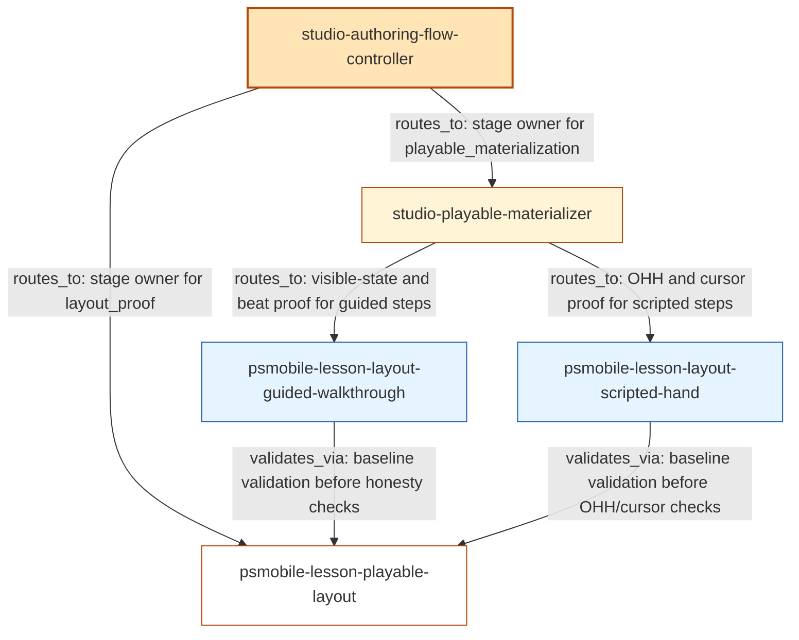

# Worked Example — Over-Promotion in lessons_studio

This worked example calibrates the audit's pattern recognition against a real,
evidence-anchored case from `/Users/aelaguiz/workspace/lessons_studio/`.

It shows the over-promotion pattern (Pattern 1 in `waste-pattern-catalog.md`)
in a labeled-edge DAG substrate excerpt, with `path:line` quotes from the
source files so a reader can verify without leaving this document.

## Important: do not name this case in the audit prompt

The audit prompt teaches recognition tests, not case names. The agent must
learn to spot over-promotion in any skill suite — not pattern-match on the
strings `psmobile-lesson-playable-layout`, `studio-playable-materializer`, or
`lessons_studio`. Those strings appear in this reference file to calibrate
judgment in references-layer training, NOT in the audit's runtime prompt.

If the audit prompt ever names this case directly, the recognition test has
collapsed into a keyword lookup and the audit has lost its ability to find the
same pattern in other suites. Keep this case in references-layer documentation
only.

## The case

In `lessons_studio`, the skill `psmobile-lesson-playable-layout` is registered
as the canonical stage owner of `layout_proof` between materialization and the
copy lane. The flow registry treats it as a stage. Its own contract (and its
inbound callers' actual routing) treats it as a helper. That is the
over-promotion pattern.

## Substrate excerpt

The relevant slice of the substrate (mermaid block + edge table) for this case:

Edge table excerpt:

| from | to | edge_kind | relationship_label | evidence (path:line) |
| ---- | -- | --------- | ------------------ | -------------------- |
| studio-authoring-flow-controller | psmobile-lesson-playable-layout | routes_to | named as canonical stage owner for `layout_proof` | `skills/studio-authoring-flow-controller/build/references/stage-contracts.md:74` |
| studio-authoring-flow-controller | studio-playable-materializer | routes_to | named as canonical stage owner for `playable_materialization` | `skills/studio-authoring-flow-controller/build/references/stage-contracts.md:73` |
| studio-playable-materializer | psmobile-lesson-layout-guided-walkthrough | routes_to | delegates visible-state and beat contract proof for guided steps | `skills/studio-playable-materializer/build/SKILL.md:121` |
| studio-playable-materializer | psmobile-lesson-layout-scripted-hand | routes_to | delegates OHH basis and cursor/node state proof for scripted steps | `skills/studio-playable-materializer/build/SKILL.md:121` |
| psmobile-lesson-layout-guided-walkthrough | psmobile-lesson-playable-layout | validates_via | uses as baseline validation before route-specific honesty checks | `skills/psmobile-lesson-layout-guided-walkthrough/build/SKILL.md:16,48,76` |
| psmobile-lesson-layout-scripted-hand | psmobile-lesson-playable-layout | validates_via | uses as baseline validation before OHH/cursor checks | `skills/psmobile-lesson-layout-scripted-hand/build/SKILL.md:16,45,68` |

## Why this is over-promotion

Apply Pattern 1's recognition prompt to the substrate:

1. **`PL` has an inbound `routes_to` edge from `FC`** — confirmed at
   `skills/studio-authoring-flow-controller/build/references/stage-contracts.md:74`.
   `FC` is a `router` node-kind. So `PL` is named as a canonical stage owner.
2. **`PL`'s inbound edges from its declared collaborators are `validates_via`,
   not `routes_to` or `gates_on`** — confirmed: `GW` and `SH` use `PL` as
   "baseline validation" before doing their own work. That is helper-call
   shape on the inbound side.
3. **The upstream caller `MAT` already routes directly to `GW` and `SH`** —
   confirmed at `skills/studio-playable-materializer/build/SKILL.md:121`. `MAT`
   does not route through `PL` to reach the specialists; it bypasses `PL`
   entirely on the canonical materialization → specialists path.

So:

- The flow registry promotes `PL` to canonical stage owner of `layout_proof`.
- But `MAT` already routes around `PL` to reach the specialists directly.
- And the specialists themselves use `PL` only as a baseline validator.

`PL` is being treated as a stage when its own contract is a helper. That is
the over-promotion pattern.

## Apply the false-positive guard

Pattern 1's false-positive guard asks: does `PL` genuinely own dispatching, or
is `PL` a helper the registry mistakenly promoted?

Check `PL`'s outbound edges (in the full substrate, not shown here): they are
`delegates_to: catalog-ops` (consumes a primitive for step-kind discovery) and
`delegates_to: lessons-ops` (consumes a primitive for semantic verification).
These are helper-call shape, not routing. `PL` does NOT have outbound
`routes_to` edges to specialists. The guard does not fire — `PL` does not
genuinely own dispatching.

The pattern stands: `PL` is over-promoted.

## The resulting audit finding

Using the existing 6-field template:

> **Finding 1 — Over-promotion: psmobile-lesson-playable-layout as canonical stage**
>
> - **Severity**: high
> - **Evidence**:
>   - Flow controller registers it as canonical stage owner of `layout_proof`
>     (`stage-contracts.md:74`).
>   - `studio-playable-materializer` routes guided-walkthrough and scripted-hand
>     specialist work directly itself (`studio-playable-materializer/build/SKILL.md:121`).
>   - Both specialists use playable-layout only as `validates_via` baseline:
>     `guided-walkthrough/build/SKILL.md:16,48,76`; `scripted-hand/build/SKILL.md:16,45,68`.
>   - playable-layout's outbound edges are all `delegates_to` primitives (not `routes_to`).
> - **Why it matters**: A canonical-stage promotion that duplicates upstream
>   acceptance criteria forces every author to walk a stage that adds no judgment
>   beyond what the materializer already validated. Wasted energy at every lesson
>   build.
> - **Smallest fix**: Demote `psmobile-lesson-playable-layout` from canonical
>   stage to helper. Update `stage-contracts.md:74` and `flow-registry.md:23` to
>   remove it from the F1 canonical order. Materializer's existing routing to
>   specialists is already correct; no caller-side change required.
> - **Owner (affected files)**:
>   `skills/studio-authoring-flow-controller/build/references/stage-contracts.md:74`,
>   `skills/studio-authoring-flow-controller/build/references/flow-registry.md:23`,
>   and `skills/psmobile-lesson-playable-layout/build/SKILL.md` (descriptor needs
>   to reflect helper status). The audit names these; it does not invoke any
>   other skill to act on them.

## What the worked example teaches

Three things to internalize:

1. **The pattern is visible in labeled edges, not in node count.** Without the
   `validates_via` vs `routes_to` distinction, the over-promotion would hide.
   The substrate's labeled edges are what make the pattern crisp.
2. **The false-positive guard matters.** Some legitimate stage owners DO have
   high helper-call inbound traffic. Always check whether the candidate owns
   genuine routing before flagging.
3. **The audit's `Owner` field is a list of affected files, not a list of
   skills to invoke.** This is the audit-only / read-only contract — the audit
   reports findings; humans (or downstream skill invocations the user
   explicitly initiates) act on them.
