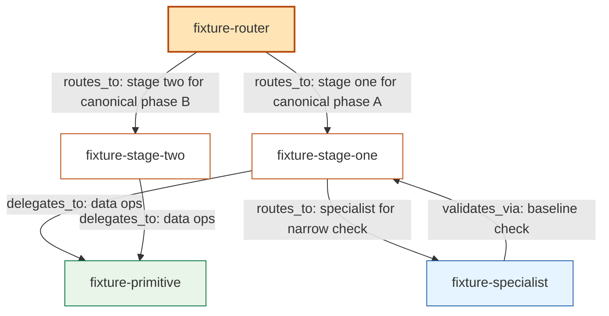

# Tiny Substrate Fixture (5 nodes, 6 edges)

Used by `render_dag_d2.py` snapshot test. Mirrors the substrate format from
`../../references/dag-substrate-format.md`.

| from | to | edge_kind | relationship_label | evidence (path:line) |
| ---- | -- | --------- | ------------------ | -------------------- |
| fixture-router | fixture-stage-one | routes_to | routes_to stage one for canonical phase A | skills/fixture-router/SKILL.md:10 |
| fixture-router | fixture-stage-two | routes_to | routes_to stage two for canonical phase B | skills/fixture-router/SKILL.md:11 |
| fixture-stage-one | fixture-primitive | delegates_to | delegates data ops to primitive | skills/fixture-stage-one/SKILL.md:20 |
| fixture-stage-one | fixture-specialist | routes_to | routes to specialist for narrow check | skills/fixture-stage-one/SKILL.md:25 |
| fixture-stage-two | fixture-primitive | delegates_to | delegates data ops to primitive | skills/fixture-stage-two/SKILL.md:18 |
| fixture-specialist | fixture-stage-one | validates_via | validates_via baseline check | skills/fixture-specialist/SKILL.md:14 |

## Unresolved references

_None._
